# 设计文档

## 概述

本文档描述了基于AWS Amplify Gen2构建的用户管理应用的技术设计。该应用使用TypeScript和React构建，采用Amplify的代码优先(code-first)开发方式，提供用户注册、登录和个人资料管理功能。

### 技术栈

- **前端框架**: React 18+ with TypeScript
- **UI组件库**: @aws-amplify/ui-react (Authenticator组件)
- **后端服务**: AWS Amplify Gen2
  - **身份验证**: Amplify Auth (Amazon Cognito)
  - **数据存储**: Amplify Data (AWS AppSync + DynamoDB)
  - **文件存储**: Amplify Storage (Amazon S3)
- **开发工具**: Vite / Create React App
- **样式**: CSS Modules / Tailwind CSS (WhatsApp风格)

### 架构原则

1. **TypeScript优先**: 使用Amplify Gen2的TypeScript-first DX，确保类型安全
2. **代码即配置**: 所有后端资源通过TypeScript代码定义
3. **基于所有者的授权**: 使用Amplify的owner-based authorization确保数据安全
4. **响应式设计**: 适配移动端和桌面端
5. **最小权限原则**: 用户只能访问自己的数据

## 架构

### 系统架构图

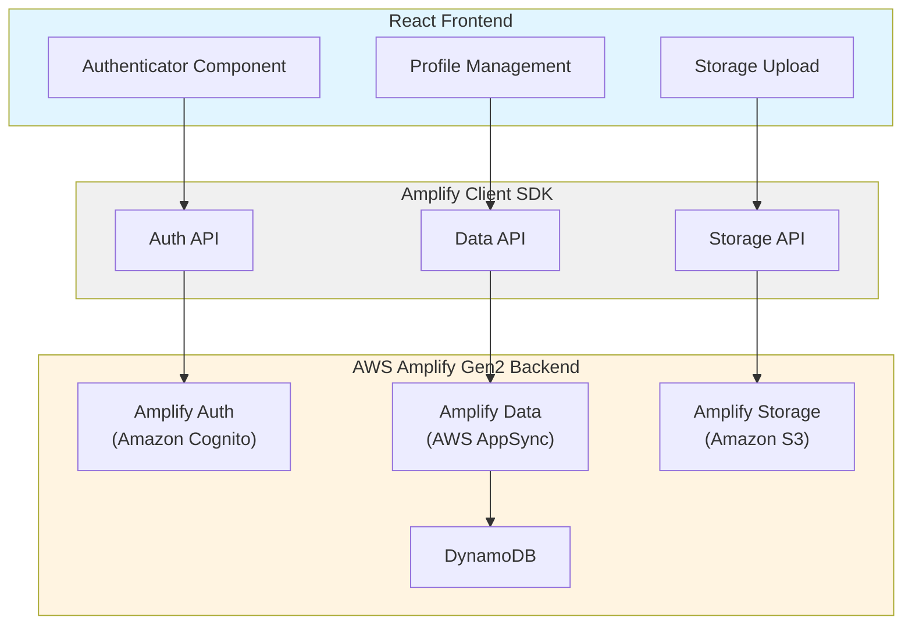
```mermaid
graph TB
    subgraph Frontend["React Frontend"]
        Auth["Authenticator Component"]
        Profile["Profile Management"]
        Storage["Storage Upload"]
    end
    
    subgraph AmplifyClient["Amplify Client SDK"]
        AuthSDK["Auth API"]
        DataSDK["Data API"]
        StorageSDK["Storage API"]
    end
    
    subgraph AWS["AWS Amplify Gen2 Backend"]
        Cognito["Amplify Auth<br/>(Amazon Cognito)"]
        AppSync["Amplify Data<br/>(AWS AppSync)"]
        DynamoDB["DynamoDB"]
        S3["Amplify Storage<br/>(Amazon S3)"]
    end
    
    Auth --> AuthSDK
    Profile --> DataSDK
    Storage --> StorageSDK
    
    AuthSDK --> Cognito
    DataSDK --> AppSync
    StorageSDK --> S3
    
    AppSync --> DynamoDB
    
    style Frontend fill:#e1f5ff
    style AWS fill:#fff4e1
    style AmplifyClient fill:#f0f0f0
```

### 用户注册流程

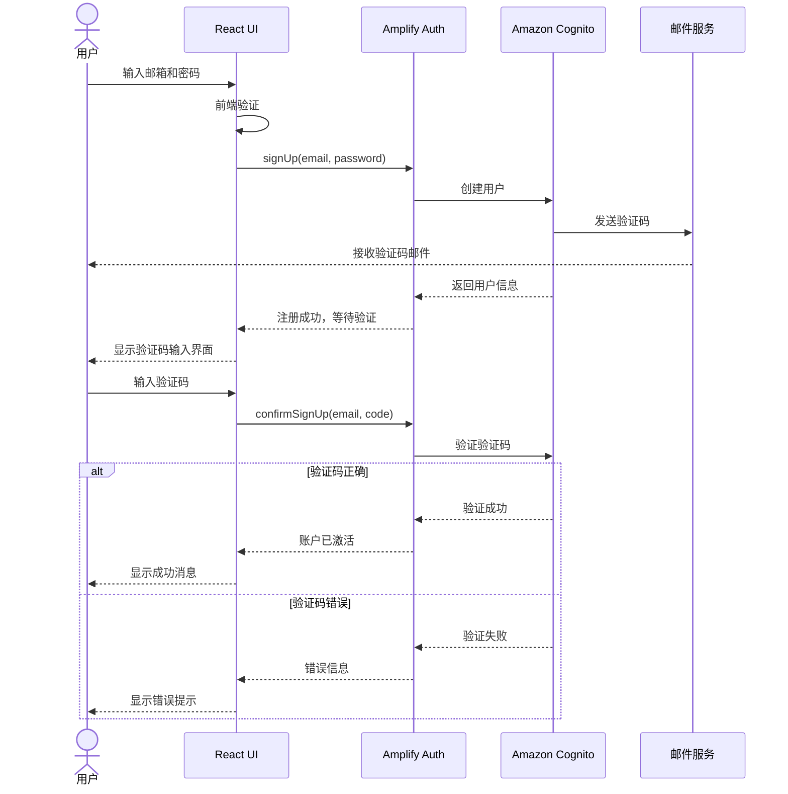
```mermaid
sequenceDiagram
    actor User as 用户
    participant UI as React UI
    participant Auth as Amplify Auth
    participant Cognito as Amazon Cognito
    participant Email as 邮件服务
    
    User->>UI: 输入邮箱和密码
    UI->>UI: 前端验证
    UI->>Auth: signUp(email, password)
    Auth->>Cognito: 创建用户
    Cognito->>Email: 发送验证码
    Email-->>User: 接收验证码邮件
    Cognito-->>Auth: 返回用户信息
    Auth-->>UI: 注册成功，等待验证
    UI-->>User: 显示验证码输入界面
    
    User->>UI: 输入验证码
    UI->>Auth: confirmSignUp(email, code)
    Auth->>Cognito: 验证验证码
    alt 验证码正确
        Cognito-->>Auth: 验证成功
        Auth-->>UI: 账户已激活
        UI-->>User: 显示成功消息
    else 验证码错误
        Cognito-->>Auth: 验证失败
        Auth-->>UI: 错误信息
        UI-->>User: 显示错误提示
    end
```

### 用户登录流程

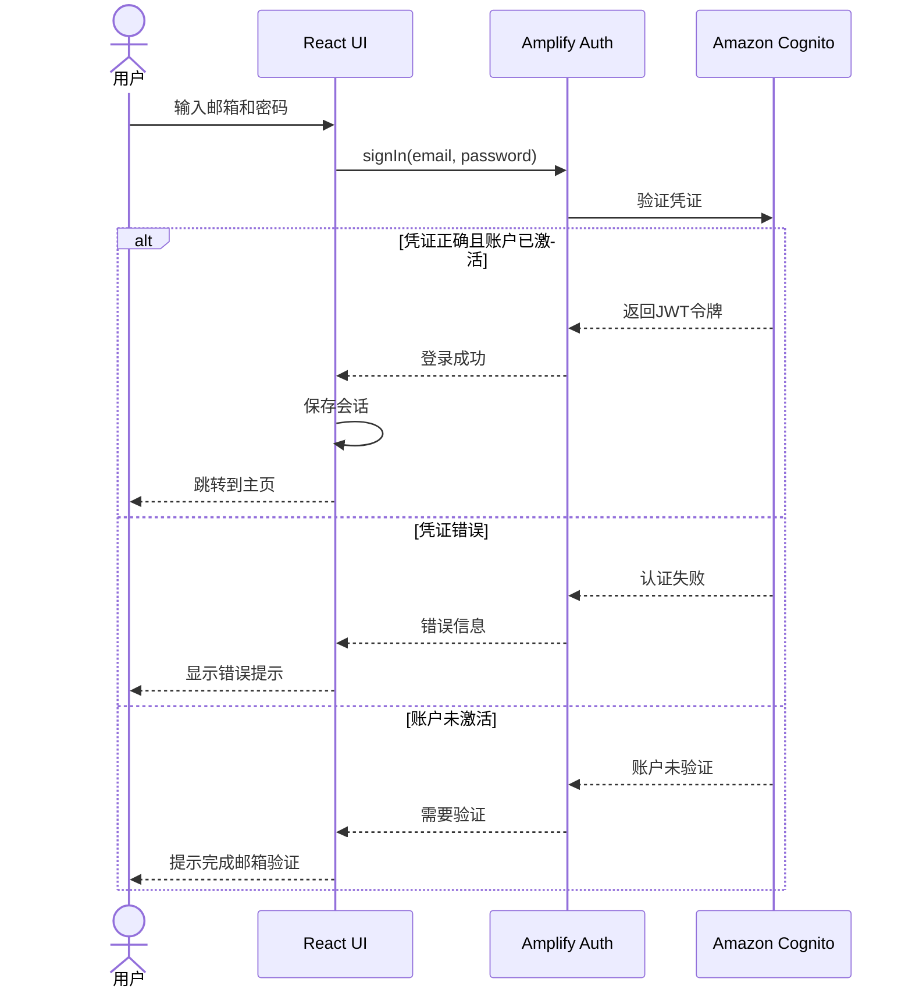
```mermaid
sequenceDiagram
    actor User as 用户
    participant UI as React UI
    participant Auth as Amplify Auth
    participant Cognito as Amazon Cognito
    
    User->>UI: 输入邮箱和密码
    UI->>Auth: signIn(email, password)
    Auth->>Cognito: 验证凭证
    
    alt 凭证正确且账户已激活
        Cognito-->>Auth: 返回JWT令牌
        Auth-->>UI: 登录成功
        UI->>UI: 保存会话
        UI-->>User: 跳转到主页
    else 凭证错误
        Cognito-->>Auth: 认证失败
        Auth-->>UI: 错误信息
        UI-->>User: 显示错误提示
    else 账户未激活
        Cognito-->>Auth: 账户未验证
        Auth-->>UI: 需要验证
        UI-->>User: 提示完成邮箱验证
    end
```

### 个人资料更新流程

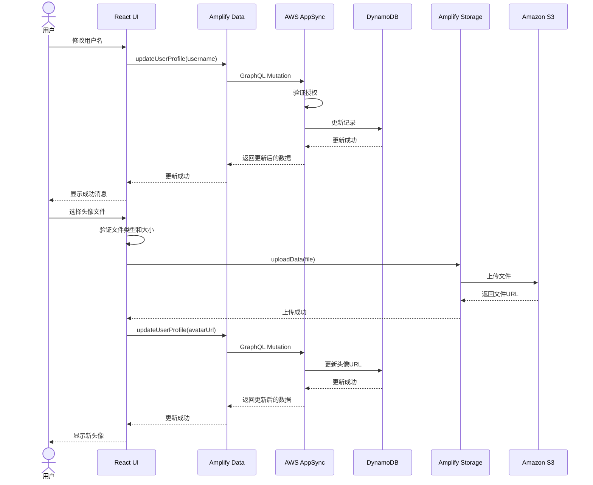
```mermaid
sequenceDiagram
    actor User as 用户
    participant UI as React UI
    participant Data as Amplify Data
    participant AppSync as AWS AppSync
    participant DDB as DynamoDB
    participant Storage as Amplify Storage
    participant S3 as Amazon S3
    
    User->>UI: 修改用户名
    UI->>Data: updateUserProfile(username)
    Data->>AppSync: GraphQL Mutation
    AppSync->>AppSync: 验证授权
    AppSync->>DDB: 更新记录
    DDB-->>AppSync: 更新成功
    AppSync-->>Data: 返回更新后的数据
    Data-->>UI: 更新成功
    UI-->>User: 显示成功消息
    
    User->>UI: 选择头像文件
    UI->>UI: 验证文件类型和大小
    UI->>Storage: uploadData(file)
    Storage->>S3: 上传文件
    S3-->>Storage: 返回文件URL
    Storage-->>UI: 上传成功
    UI->>Data: updateUserProfile(avatarUrl)
    Data->>AppSync: GraphQL Mutation
    AppSync->>DDB: 更新头像URL
    DDB-->>AppSync: 更新成功
    AppSync-->>Data: 返回更新后的数据
    Data-->>UI: 更新成功
    UI-->>User: 显示新头像
```

## 组件和接口

### 组件架构概览

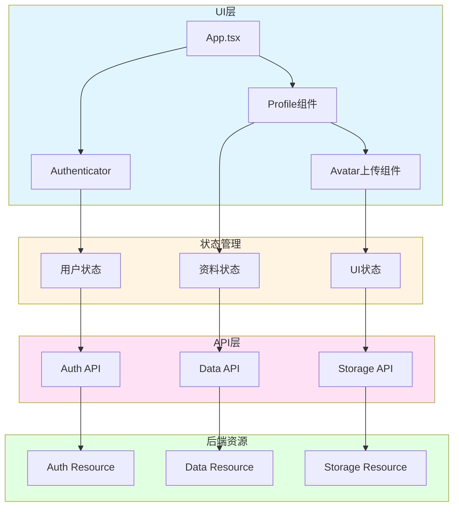
```mermaid
graph TB
    subgraph UI["UI层"]
        App["App.tsx"]
        Auth["Authenticator"]
        Profile["Profile组件"]
        Avatar["Avatar上传组件"]
    end
    
    subgraph State["状态管理"]
        UserState["用户状态"]
        ProfileState["资料状态"]
        UIState["UI状态"]
    end
    
    subgraph API["API层"]
        AuthAPI["Auth API"]
        DataAPI["Data API"]
        StorageAPI["Storage API"]
    end
    
    subgraph Backend["后端资源"]
        AuthRes["Auth Resource"]
        DataRes["Data Resource"]
        StorageRes["Storage Resource"]
    end
    
    App --> Auth
    App --> Profile
    Profile --> Avatar
    
    Auth --> UserState
    Profile --> ProfileState
    Avatar --> UIState
    
    UserState --> AuthAPI
    ProfileState --> DataAPI
    UIState --> StorageAPI
    
    AuthAPI --> AuthRes
    DataAPI --> DataRes
    StorageAPI --> StorageRes
    
    style UI fill:#e1f5ff
    style State fill:#fff4e1
    style API fill:#ffe1f5
    style Backend fill:#e1ffe1
```

### React组件层次结构

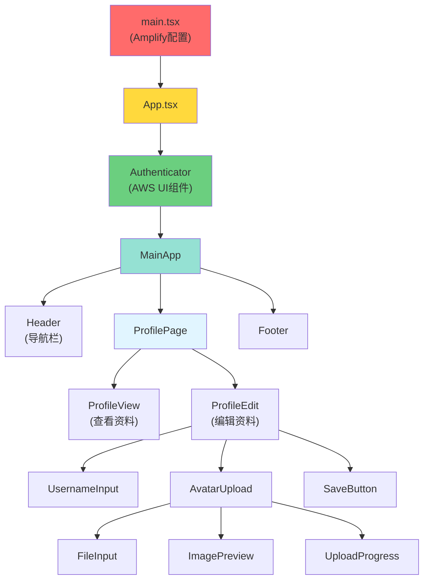
```mermaid
graph TB
    Main["main.tsx<br/>(Amplify配置)"]
    
    Main --> App["App.tsx"]
    
    App --> Authenticator["Authenticator<br/>(AWS UI组件)"]
    
    Authenticator --> MainApp["MainApp"]
    
    MainApp --> Header["Header<br/>(导航栏)"]
    MainApp --> ProfilePage["ProfilePage"]
    MainApp --> Footer["Footer"]
    
    ProfilePage --> ProfileView["ProfileView<br/>(查看资料)"]
    ProfilePage --> ProfileEdit["ProfileEdit<br/>(编辑资料)"]
    
    ProfileEdit --> UsernameInput["UsernameInput"]
    ProfileEdit --> AvatarUpload["AvatarUpload"]
    ProfileEdit --> SaveButton["SaveButton"]
    
    AvatarUpload --> FileInput["FileInput"]
    AvatarUpload --> Preview["ImagePreview"]
    AvatarUpload --> UploadProgress["UploadProgress"]
    
    style Main fill:#ff6b6b
    style App fill:#ffd93d
    style Authenticator fill:#6bcf7f
    style MainApp fill:#95e1d3
    style ProfilePage fill:#e1f5ff
```

### 后端资源定义

#### 1. 身份验证资源 (amplify/auth/resource.ts)

```typescript
import { defineAuth } from '@aws-amplify/backend';

export const auth = defineAuth({
  loginWith: {
    email: {
      verificationEmailStyle: 'CODE',
      verificationEmailSubject: '验证您的账户',
      verificationEmailBody: (code) => 
        `您的验证码是: ${code}。请在应用中输入此验证码以完成注册。`,
    },
  },
  userAttributes: {
    profilePicture: {
      mutable: true,
      required: false,
    },
    preferredUsername: {
      mutable: true,
      required: false,
    },
  },
  accountRecovery: 'EMAIL_ONLY',
});
```

#### 2. 数据资源 (amplify/data/resource.ts)

```typescript
import { type ClientSchema, a, defineData } from '@aws-amplify/backend';

const schema = a.schema({
  UserProfile: a
    .model({
      userId: a.id().required(),
      username: a.string().required(),
      avatarUrl: a.string(),
      email: a.email().required(),
      createdAt: a.datetime(),
      updatedAt: a.datetime(),
    })
    .authorization((allow) => [
      allow.owner(),
    ]),
});

export type Schema = ClientSchema<typeof schema>;

export const data = defineData({
  schema,
  authorizationModes: {
    defaultAuthorizationMode: 'userPool',
  },
});
```

#### 3. 存储资源 (amplify/storage/resource.ts)

```typescript
import { defineStorage } from '@aws-amplify/backend';

export const storage = defineStorage({
  name: 'userProfileStorage',
  access: (allow) => ({
    'profile-pictures/{entity_id}/*': [
      allow.entity('identity').to(['read', 'write', 'delete']),
    ],
  }),
});
```

#### 4. 后端配置 (amplify/backend.ts)

```typescript
import { defineBackend } from '@aws-amplify/backend';
import { auth } from './auth/resource';
import { data } from './data/resource';
import { storage } from './storage/resource';

defineBackend({
  auth,
  data,
  storage,
});
```

### 前端组件

#### 1. 应用入口 (src/main.tsx)

```typescript
import { Amplify } from 'aws-amplify';
import outputs from '../amplify_outputs.json';

Amplify.configure(outputs);
```

#### 2. 认证组件 (src/App.tsx)

```typescript
import { Authenticator } from '@aws-amplify/ui-react';
import '@aws-amplify/ui-react/styles.css';

function App() {
  return (
    <Authenticator>
      {({ signOut, user }) => (
        <MainApp user={user} signOut={signOut} />
      )}
    </Authenticator>
  );
}
```

#### 3. 个人资料组件 (src/components/Profile.tsx)

```typescript
interface ProfileProps {
  user: AuthUser;
}

function Profile({ user }: ProfileProps) {
  const [profile, setProfile] = useState<UserProfile | null>(null);
  const [username, setUsername] = useState('');
  const [avatarFile, setAvatarFile] = useState<File | null>(null);

  // 加载用户资料
  useEffect(() => {
    loadUserProfile();
  }, [user]);

  // 更新用户名
  const updateUsername = async () => {
    // 使用Amplify Data API更新
  };

  // 上传头像
  const uploadAvatar = async () => {
    // 使用Amplify Storage API上传
  };

  return (
    // UI组件
  );
}
```

### API接口

#### Amplify Data API

```typescript
import { generateClient } from 'aws-amplify/data';
import type { Schema } from '../amplify/data/resource';

const client = generateClient<Schema>();

// 创建用户资料
await client.models.UserProfile.create({
  userId: user.userId,
  username: username,
  email: user.signInDetails?.loginId,
});

// 更新用户资料
await client.models.UserProfile.update({
  id: profileId,
  username: newUsername,
  avatarUrl: newAvatarUrl,
});

// 查询用户资料
const { data } = await client.models.UserProfile.list({
  filter: { userId: { eq: user.userId } },
});
```

#### Amplify Storage API

```typescript
import { uploadData, getUrl } from 'aws-amplify/storage';

// 上传头像
const result = await uploadData({
  path: `profile-pictures/${identityId}/${file.name}`,
  data: file,
  options: {
    contentType: file.type,
  },
}).result;

// 获取头像URL
const urlResult = await getUrl({
  path: `profile-pictures/${identityId}/${fileName}`,
});
```

## 数据模型

### UserProfile 模型

```typescript
interface UserProfile {
  id: string;              // DynamoDB生成的唯一ID
  userId: string;          // Cognito用户ID
  username: string;        // 用户名（可修改）
  avatarUrl?: string;      // 头像S3 URL
  email: string;           // 邮箱地址
  createdAt: string;       // 创建时间（ISO 8601）
  updatedAt: string;       // 更新时间（ISO 8601）
  owner?: string;          // Amplify自动添加的所有者字段
}
```

### 数据模型关系图

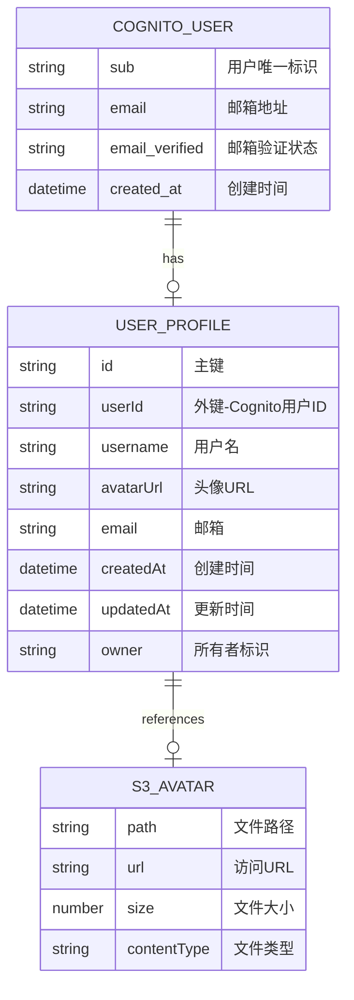
```mermaid
erDiagram
    COGNITO_USER ||--o| USER_PROFILE : "has"
    USER_PROFILE ||--o| S3_AVATAR : "references"
    
    COGNITO_USER {
        string sub "用户唯一标识"
        string email "邮箱地址"
        string email_verified "邮箱验证状态"
        datetime created_at "创建时间"
    }
    
    USER_PROFILE {
        string id "主键"
        string userId "外键-Cognito用户ID"
        string username "用户名"
        string avatarUrl "头像URL"
        string email "邮箱"
        datetime createdAt "创建时间"
        datetime updatedAt "更新时间"
        string owner "所有者标识"
    }
    
    S3_AVATAR {
        string path "文件路径"
        string url "访问URL"
        number size "文件大小"
        string contentType "文件类型"
    }
```

### 验证规则

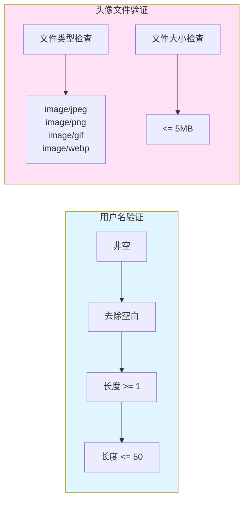
```mermaid
graph LR
    subgraph Username["用户名验证"]
        U1["非空"] --> U2["去除空白"]
        U2 --> U3["长度 >= 1"]
        U3 --> U4["长度 <= 50"]
    end
    
    subgraph Avatar["头像文件验证"]
        A1["文件类型检查"] --> A2["image/jpeg<br/>image/png<br/>image/gif<br/>image/webp"]
        A3["文件大小检查"] --> A4["<= 5MB"]
    end
    
    style Username fill:#e1f5ff
    style Avatar fill:#ffe1f5
```

**username验证规则**: 
- 非空
- 去除前后空白后长度 >= 1
- 长度 <= 50字符
  
**avatarFile验证规则**:
- 文件类型: image/jpeg, image/png, image/gif, image/webp
- 文件大小: <= 5MB (5 * 1024 * 1024 bytes)

## 正确
性属性

*属性是一个特征或行为，应该在系统的所有有效执行中保持为真——本质上是关于系统应该做什么的形式化陈述。属性作为人类可读规范和机器可验证正确性保证之间的桥梁。*

基于需求文档中的验收标准，我们识别出以下可测试的正确性属性：

### 属性 1: 有效注册创建账户
*对于任何*有效的邮箱地址和符合安全要求的密码，调用注册API应该成功创建一个新的用户账户
**验证需求: 1.1**

### 属性 2: 无效密码被拒绝
*对于任何*不符合安全要求的密码（长度不足、缺少特殊字符等），注册API应该拒绝请求并返回密码要求说明
**验证需求: 1.3**

### 属性 3: 正确验证码激活账户
*对于任何*未激活的用户账户和其对应的正确验证码，验证API应该成功激活该账户
**验证需求: 1.5**

### 属性 4: 错误验证码被拒绝
*对于任何*用户账户和不匹配的验证码，验证API应该拒绝验证并返回错误提示
**验证需求: 1.6**

### 属性 5: 正确凭证授予访问
*对于任何*已激活的用户账户，使用正确的邮箱和密码登录应该成功并返回有效的会话令牌
**验证需求: 2.1**

### 属性 6: 错误凭证被拒绝
*对于任何*用户账户，使用错误的邮箱或密码登录应该失败并返回错误提示
**验证需求: 2.2**

### 属性 7: 会话保持直到登出
*对于任何*成功登录的用户，会话应该保持有效直到用户主动调用登出API
**验证需求: 2.4**

### 属性 8: 资料显示正确内容
*对于任何*用户资料，访问个人资料页面应该返回该用户的用户名和头像URL
**验证需求: 3.1**

### 属性 9: 用户名更新往返一致性
*对于任何*有效的新用户名，更新后立即查询应该返回相同的用户名
**验证需求: 3.2**

### 属性 10: 头像上传往返一致性
*对于任何*有效的图片文件，上传后通过返回的URL下载应该得到相同的文件内容
**验证需求: 3.3**

### 属性 11: 空白用户名被拒绝
*对于任何*仅包含空白字符的字符串（空字符串、空格、制表符、换行符等），用户名更新API应该拒绝请求并返回错误提示
**验证需求: 3.4**

### 属性 12: 非图片文件被拒绝
*对于任何*非图片格式的文件（如文本文件、PDF等），头像上传API应该拒绝上传并返回支持的文件格式说明
**验证需求: 3.6**

### 属性 13: 用户只能访问自己的资料
*对于任何*两个不同的用户A和B，用户A尝试访问用户B的资料应该被拒绝并返回授权错误
**验证需求: 5.1, 5.2**

### 属性 14: 用户只能访问自己的头像
*对于任何*两个不同的用户A和B，用户A尝试访问用户B的头像文件应该被拒绝并返回授权错误
**验证需求: 5.3, 5.4**

## 错误处理

### 错误类型层次结构

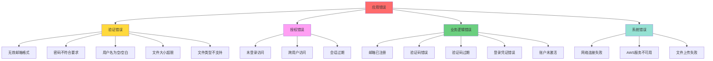
```mermaid
graph TD
    Error["应用错误"]
    
    Error --> Validation["验证错误"]
    Error --> Auth["授权错误"]
    Error --> Business["业务逻辑错误"]
    Error --> System["系统错误"]
    
    Validation --> V1["无效邮箱格式"]
    Validation --> V2["密码不符合要求"]
    Validation --> V3["用户名为空/空白"]
    Validation --> V4["文件大小超限"]
    Validation --> V5["文件类型不支持"]
    
    Auth --> A1["未登录访问"]
    Auth --> A2["跨用户访问"]
    Auth --> A3["会话过期"]
    
    Business --> B1["邮箱已注册"]
    Business --> B2["验证码错误"]
    Business --> B3["验证码过期"]
    Business --> B4["登录凭证错误"]
    Business --> B5["账户未激活"]
    
    System --> S1["网络连接失败"]
    System --> S2["AWS服务不可用"]
    System --> S3["文件上传失败"]
    
    style Error fill:#ff6b6b
    style Validation fill:#ffd93d
    style Auth fill:#ff9ff3
    style Business fill:#6bcf7f
    style System fill:#95e1d3
```

### 错误类型详细说明

1. **验证错误 (Validation Errors)**
   - 无效的邮箱格式
   - 密码不符合安全要求
   - 用户名为空或仅包含空白
   - 文件大小超过限制
   - 文件类型不支持

2. **授权错误 (Authorization Errors)**
   - 未登录用户尝试访问受保护资源
   - 用户尝试访问其他用户的数据
   - 会话过期

3. **业务逻辑错误 (Business Logic Errors)**
   - 邮箱已被注册
   - 验证码错误或过期
   - 登录凭证错误
   - 账户未激活

4. **系统错误 (System Errors)**
   - 网络连接失败
   - AWS服务暂时不可用
   - 文件上传失败

### 错误处理策略

```typescript
// 前端错误处理示例
try {
  await client.models.UserProfile.update({
    id: profileId,
    username: newUsername,
  });
} catch (error) {
  if (error.errors) {
    // GraphQL错误
    error.errors.forEach((err) => {
      if (err.errorType === 'Unauthorized') {
        // 授权错误处理
        showError('您没有权限执行此操作');
      } else if (err.errorType === 'ValidationException') {
        // 验证错误处理
        showError('输入数据无效');
      }
    });
  } else {
    // 网络或其他错误
    showError('操作失败，请稍后重试');
  }
}
```

### 用户友好的错误消息

| 错误类型 | 技术消息 | 用户消息 |
|---------|---------|---------|
| 邮箱已注册 | `UsernameExistsException` | "该邮箱已被注册，请使用其他邮箱或尝试登录" |
| 密码不符合要求 | `InvalidPasswordException` | "密码必须至少8个字符，包含大小写字母、数字和特殊字符" |
| 验证码错误 | `CodeMismatchException` | "验证码错误，请检查后重试" |
| 验证码过期 | `ExpiredCodeException` | "验证码已过期，请请求新的验证码" |
| 登录失败 | `NotAuthorizedException` | "邮箱或密码错误" |
| 账户未激活 | `UserNotConfirmedException` | "请先验证您的邮箱地址" |
| 授权失败 | `UnauthorizedException` | "您没有权限访问此资源" |
| 文件过大 | `FileSizeExceededException` | "文件大小不能超过5MB" |
| 文件类型错误 | `InvalidFileTypeException` | "仅支持JPG、PNG、GIF和WebP格式的图片" |

## 测试策略

### 测试金字塔

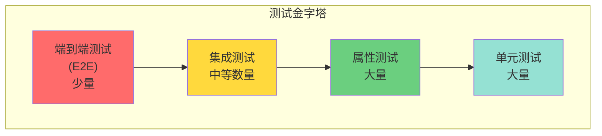
```mermaid
graph TB
    subgraph Pyramid["测试金字塔"]
        E2E["端到端测试<br/>(E2E)<br/>少量"]
        Integration["集成测试<br/>中等数量"]
        Property["属性测试<br/>大量"]
        Unit["单元测试<br/>大量"]
    end
    
    E2E --> Integration
    Integration --> Property
    Property --> Unit
    
    style E2E fill:#ff6b6b
    style Integration fill:#ffd93d
    style Property fill:#6bcf7f
    style Unit fill:#95e1d3
```

### 测试覆盖范围


```mermaid
graph LR
    subgraph Unit["单元测试"]
        U1["输入验证"]
        U2["边界情况"]
        U3["错误处理"]
    end
    
    subgraph Property["属性测试"]
        P1["注册流程"]
        P2["登录流程"]
        P3["资料更新"]
        P4["授权控制"]
    end
    
    subgraph Integration["集成测试"]
        I1["完整注册流程"]
        I2["资料管理流程"]
        I3["授权验证"]
    end
    
    subgraph E2E["端到端测试"]
        E1["用户旅程"]
        E2["响应式布局"]
    end
    
    Unit --> Property
    Property --> Integration
    Integration --> E2E
    
    style Unit fill:#e1f5ff
    style Property fill:#fff4e1
    style Integration fill:#ffe1f5
    style E2E fill:#e1ffe1
```

### 单元测试

单元测试用于验证特定的功能点和边界情况：

1. **输入验证测试**
   - 测试邮箱格式验证
   - 测试密码强度验证
   - 测试用户名空白字符验证
   - 测试文件大小和类型验证

2. **边界情况测试**
   - 重复邮箱注册
   - 验证码过期
   - 未激活账户登录
   - 会话过期
   - 文件大小边界（恰好5MB）

3. **错误处理测试**
   - 网络错误处理
   - API错误响应处理
   - 授权错误处理

### 属性测试流程

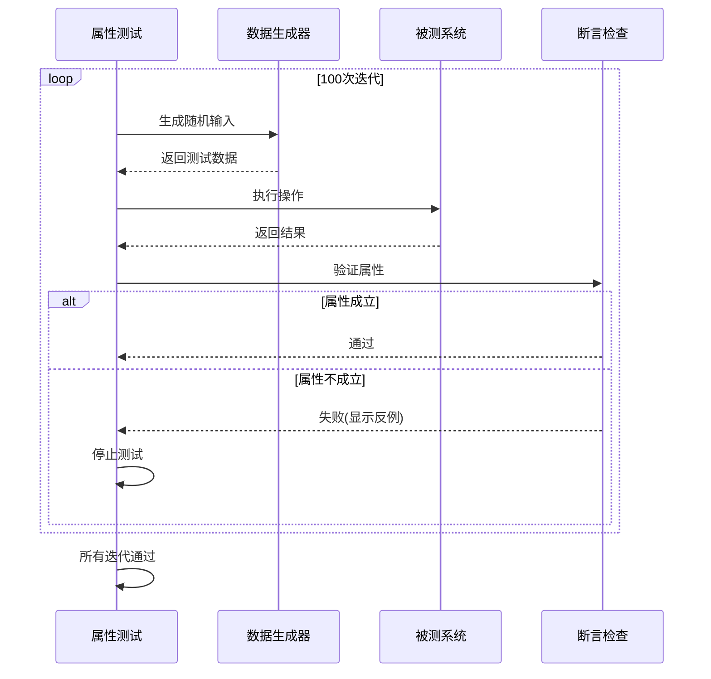
```mermaid
sequenceDiagram
    participant Test as 属性测试
    participant Gen as 数据生成器
    participant SUT as 被测系统
    participant Assert as 断言检查
    
    loop 100次迭代
        Test->>Gen: 生成随机输入
        Gen-->>Test: 返回测试数据
        Test->>SUT: 执行操作
        SUT-->>Test: 返回结果
        Test->>Assert: 验证属性
        alt 属性成立
            Assert-->>Test: 通过
        else 属性不成立
            Assert-->>Test: 失败(显示反例)
            Test->>Test: 停止测试
        end
    end
    
    Test->>Test: 所有迭代通过
```

### 属性测试

属性测试用于验证系统在各种输入下的通用正确性：

**测试框架**: 使用 `fast-check` 库进行属性测试

**配置**: 每个属性测试至少运行100次迭代

**标记格式**: 每个属性测试必须使用注释标记对应的设计文档属性
```typescript
// **Feature: amplify-im-app, Property 1: 有效注册创建账户**
```

**属性测试示例**:

```typescript
import fc from 'fast-check';

// **Feature: amplify-im-app, Property 1: 有效注册创建账户**
test('Property 1: Valid registration creates account', async () => {
  await fc.assert(
    fc.asyncProperty(
      fc.emailAddress(),
      fc.string({ minLength: 8 }).filter(isValidPassword),
      async (email, password) => {
        const result = await signUp(email, password);
        expect(result.userSub).toBeDefined();
        expect(result.isSignUpComplete).toBe(false); // 需要验证
      }
    ),
    { numRuns: 100 }
  );
});

// **Feature: amplify-im-app, Property 9: 用户名更新往返一致性**
test('Property 9: Username update round-trip consistency', async () => {
  await fc.assert(
    fc.asyncProperty(
      fc.string({ minLength: 1, maxLength: 50 }).filter(s => s.trim().length > 0),
      async (newUsername) => {
        const profile = await createTestProfile();
        await updateUsername(profile.id, newUsername);
        const updated = await getProfile(profile.id);
        expect(updated.username).toBe(newUsername);
      }
    ),
    { numRuns: 100 }
  );
});

// **Feature: amplify-im-app, Property 11: 空白用户名被拒绝**
test('Property 11: Whitespace usernames are rejected', async () => {
  await fc.assert(
    fc.asyncProperty(
      fc.stringOf(fc.constantFrom(' ', '\t', '\n', '\r')),
      async (whitespaceUsername) => {
        const profile = await createTestProfile();
        await expect(
          updateUsername(profile.id, whitespaceUsername)
        ).rejects.toThrow();
      }
    ),
    { numRuns: 100 }
  );
});

// **Feature: amplify-im-app, Property 13: 用户只能访问自己的资料**
test('Property 13: Users can only access their own profile', async () => {
  await fc.assert(
    fc.asyncProperty(
      fc.tuple(fc.emailAddress(), fc.emailAddress()).filter(([a, b]) => a !== b),
      async ([emailA, emailB]) => {
        const userA = await createTestUser(emailA);
        const userB = await createTestUser(emailB);
        
        // 用户A尝试访问用户B的资料
        await expect(
          getProfileAsUser(userA.id, userB.profileId)
        ).rejects.toThrow(/Unauthorized/);
      }
    ),
    { numRuns: 100 }
  );
});
```

### 集成测试

集成测试验证多个组件之间的交互：

1. **完整注册流程**
   - 注册 → 接收验证码 → 验证 → 登录

2. **完整资料更新流程**
   - 登录 → 更新用户名 → 上传头像 → 验证更新

3. **授权流程**
   - 创建多个用户 → 验证访问隔离

### 端到端测试

使用Cypress或Playwright进行E2E测试：

1. 用户注册和验证流程
2. 用户登录和登出流程
3. 个人资料查看和编辑流程
4. 响应式布局测试

## 性能考虑

### 前端优化

1. **图片优化**
   - 上传前压缩图片
   - 使用WebP格式
   - 实现图片懒加载

2. **缓存策略**
   - 缓存用户资料数据
   - 使用React Query管理服务器状态
   - 实现乐观更新

3. **代码分割**
   - 按路由分割代码
   - 懒加载非关键组件

### 后端优化

1. **DynamoDB优化**
   - 使用userId作为分区键
   - 为常用查询创建GSI

2. **S3优化**
   - 启用CloudFront CDN
   - 配置适当的缓存策略
   - 使用S3 Transfer Acceleration

3. **AppSync优化**
   - 启用缓存
   - 优化GraphQL查询
   - 使用批量操作

## 安全考虑

### 安全架构层次

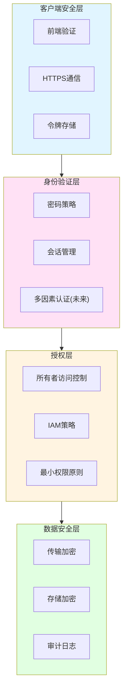
```mermaid
graph TB
    subgraph Client["客户端安全层"]
        FV["前端验证"]
        HTTPS["HTTPS通信"]
        Token["令牌存储"]
    end
    
    subgraph Auth["身份验证层"]
        Password["密码策略"]
        Session["会话管理"]
        MFA["多因素认证(未来)"]
    end
    
    subgraph AuthZ["授权层"]
        Owner["所有者访问控制"]
        IAM["IAM策略"]
        MinPriv["最小权限原则"]
    end
    
    subgraph Data["数据安全层"]
        Transit["传输加密"]
        AtRest["存储加密"]
        Audit["审计日志"]
    end
    
    Client --> Auth
    Auth --> AuthZ
    AuthZ --> Data
    
    style Client fill:#e1f5ff
    style Auth fill:#ffe1f5
    style AuthZ fill:#fff4e1
    style Data fill:#e1ffe1
```

### 数据访问授权流程

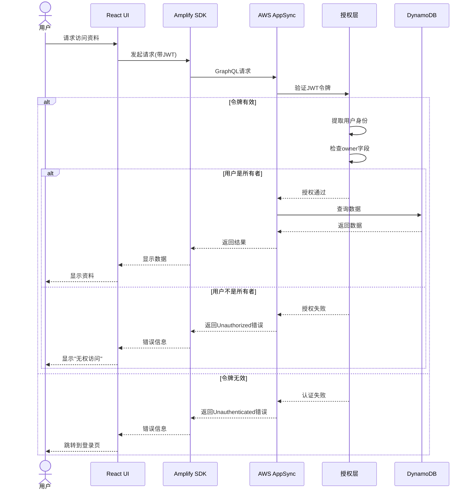
```mermaid
sequenceDiagram
    actor User as 用户
    participant UI as React UI
    participant SDK as Amplify SDK
    participant AppSync as AWS AppSync
    participant Auth as 授权层
    participant DDB as DynamoDB
    
    User->>UI: 请求访问资料
    UI->>SDK: 发起请求(带JWT)
    SDK->>AppSync: GraphQL请求
    AppSync->>Auth: 验证JWT令牌
    
    alt 令牌有效
        Auth->>Auth: 提取用户身份
        Auth->>Auth: 检查owner字段
        
        alt 用户是所有者
            Auth-->>AppSync: 授权通过
            AppSync->>DDB: 查询数据
            DDB-->>AppSync: 返回数据
            AppSync-->>SDK: 返回结果
            SDK-->>UI: 显示数据
            UI-->>User: 显示资料
        else 用户不是所有者
            Auth-->>AppSync: 授权失败
            AppSync-->>SDK: 返回Unauthorized错误
            SDK-->>UI: 错误信息
            UI-->>User: 显示"无权访问"
        end
    else 令牌无效
        Auth-->>AppSync: 认证失败
        AppSync-->>SDK: 返回Unauthenticated错误
        SDK-->>UI: 错误信息
        UI-->>User: 跳转到登录页
    end
```

### 身份验证安全

1. **密码策略**
   - 最小长度: 8字符
   - 必须包含: 大写字母、小写字母、数字、特殊字符
   - 使用Cognito的密码策略配置

2. **会话管理**
   - JWT令牌自动刷新
   - 安全的令牌存储
   - 会话超时配置

### 数据安全

1. **传输安全**
   - 所有API调用使用HTTPS
   - S3文件传输使用加密

2. **存储安全**
   - DynamoDB数据加密
   - S3存储加密
   - 敏感数据不记录日志

3. **授权安全**
   - 基于所有者的访问控制
   - 最小权限原则
   - 定期审计访问日志

### 输入验证

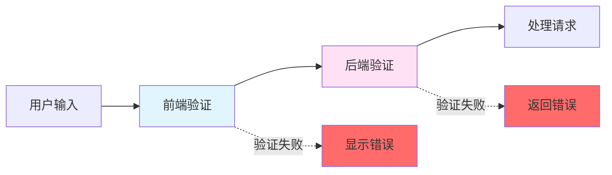
```mermaid
graph LR
    Input["用户输入"] --> Frontend["前端验证"]
    Frontend --> Backend["后端验证"]
    Backend --> Process["处理请求"]
    
    Frontend -.->|验证失败| Error1["显示错误"]
    Backend -.->|验证失败| Error2["返回错误"]
    
    style Frontend fill:#e1f5ff
    style Backend fill:#ffe1f5
    style Error1 fill:#ff6b6b
    style Error2 fill:#ff6b6b
```

1. **前端验证**
   - 邮箱格式验证
   - 密码强度验证
   - 文件类型和大小验证

2. **后端验证**
   - Amplify Data的schema验证
   - 自定义Lambda验证器
   - 防止SQL注入和XSS攻击

## 部署策略

### 环境架构

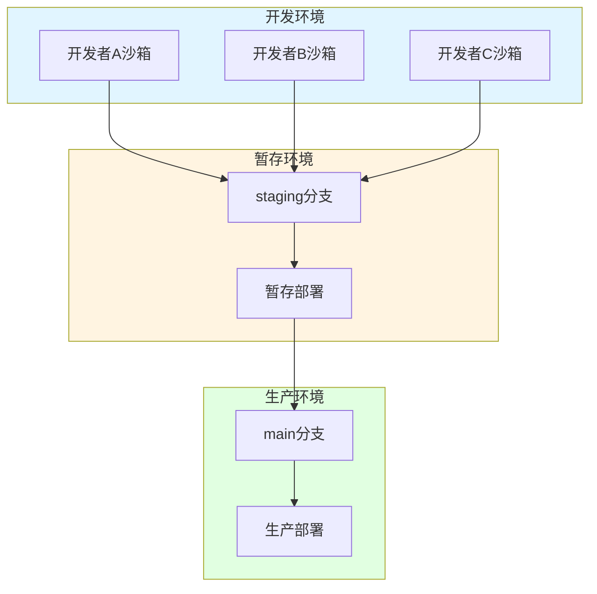
```mermaid
graph TB
    subgraph Dev["开发环境"]
        Dev1["开发者A沙箱"]
        Dev2["开发者B沙箱"]
        Dev3["开发者C沙箱"]
    end
    
    subgraph Staging["暂存环境"]
        StagingBranch["staging分支"]
        StagingDeploy["暂存部署"]
    end
    
    subgraph Prod["生产环境"]
        MainBranch["main分支"]
        ProdDeploy["生产部署"]
    end
    
    Dev1 --> StagingBranch
    Dev2 --> StagingBranch
    Dev3 --> StagingBranch
    
    StagingBranch --> StagingDeploy
    StagingDeploy --> MainBranch
    MainBranch --> ProdDeploy
    
    style Dev fill:#e1f5ff
    style Staging fill:#fff4e1
    style Prod fill:#e1ffe1
```

### CI/CD流程图

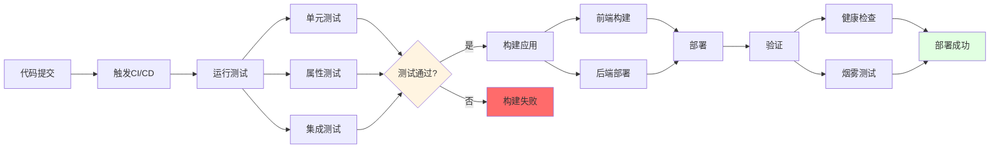
```mermaid
graph LR
    Commit["代码提交"] --> Trigger["触发CI/CD"]
    Trigger --> Test["运行测试"]
    
    Test --> Unit["单元测试"]
    Test --> Prop["属性测试"]
    Test --> Int["集成测试"]
    
    Unit --> TestResult{测试通过?}
    Prop --> TestResult
    Int --> TestResult
    
    TestResult -->|是| Build["构建应用"]
    TestResult -->|否| Fail["构建失败"]
    
    Build --> FrontBuild["前端构建"]
    Build --> BackBuild["后端部署"]
    
    FrontBuild --> Deploy["部署"]
    BackBuild --> Deploy
    
    Deploy --> Verify["验证"]
    Verify --> Health["健康检查"]
    Verify --> Smoke["烟雾测试"]
    
    Health --> Success["部署成功"]
    Smoke --> Success
    
    style TestResult fill:#fff4e1
    style Success fill:#e1ffe1
    style Fail fill:#ff6b6b
```

### 开发环境

使用Amplify Sandbox进行本地开发：

```bash
npx ampx sandbox
```

每个开发者拥有独立的云沙箱环境，互不干扰。

### 暂存环境

连接到Git分支的暂存环境：

```bash
git checkout staging
git push origin staging
```

Amplify自动部署暂存环境。

### 生产环境

通过主分支部署生产环境：

```bash
git checkout main
git merge staging
git push origin main
```

### 部署流程详细步骤

1. **代码提交** → 触发CI/CD
2. **运行测试** → 单元测试、属性测试、集成测试
3. **构建应用** → 前端构建、后端部署
4. **部署** → 自动部署到对应环境
5. **验证** → 健康检查、烟雾测试

## 监控和日志

### 监控架构

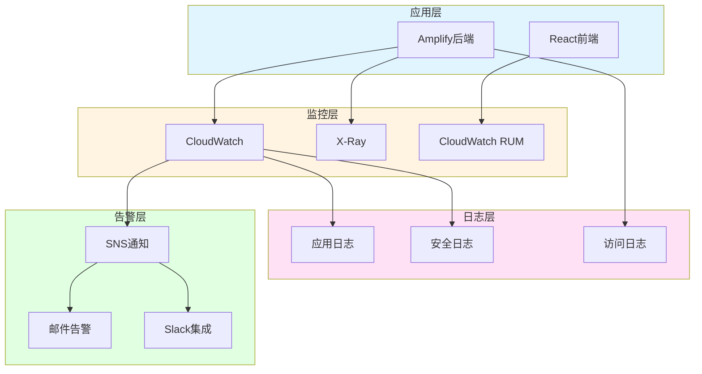
```mermaid
graph TB
    subgraph App["应用层"]
        Frontend["React前端"]
        Backend["Amplify后端"]
    end
    
    subgraph Monitoring["监控层"]
        CW["CloudWatch"]
        XRay["X-Ray"]
        RUM["CloudWatch RUM"]
    end
    
    subgraph Logging["日志层"]
        AppLogs["应用日志"]
        SecurityLogs["安全日志"]
        AccessLogs["访问日志"]
    end
    
    subgraph Alerting["告警层"]
        SNS["SNS通知"]
        Email["邮件告警"]
        Slack["Slack集成"]
    end
    
    Frontend --> RUM
    Backend --> CW
    Backend --> XRay
    
    CW --> AppLogs
    CW --> SecurityLogs
    Backend --> AccessLogs
    
    CW --> SNS
    SNS --> Email
    SNS --> Slack
    
    style App fill:#e1f5ff
    style Monitoring fill:#fff4e1
    style Logging fill:#ffe1f5
    style Alerting fill:#e1ffe1
```

### 关键指标监控

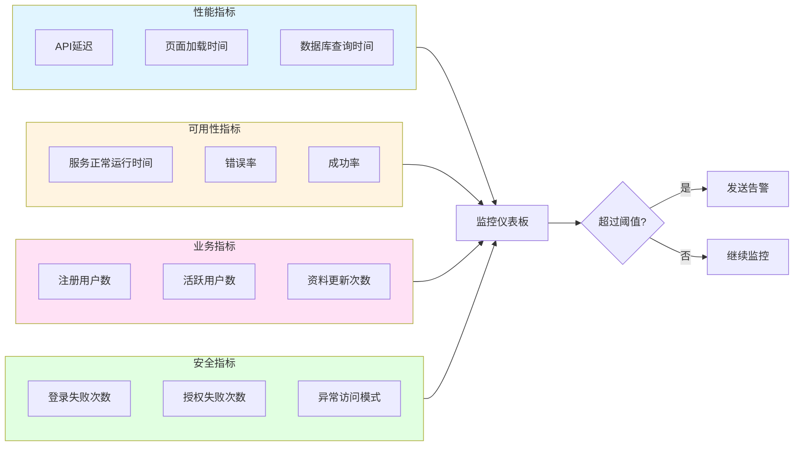
```mermaid
graph LR
    subgraph Performance["性能指标"]
        P1["API延迟"]
        P2["页面加载时间"]
        P3["数据库查询时间"]
    end
    
    subgraph Availability["可用性指标"]
        A1["服务正常运行时间"]
        A2["错误率"]
        A3["成功率"]
    end
    
    subgraph Business["业务指标"]
        B1["注册用户数"]
        B2["活跃用户数"]
        B3["资料更新次数"]
    end
    
    subgraph Security["安全指标"]
        S1["登录失败次数"]
        S2["授权失败次数"]
        S3["异常访问模式"]
    end
    
    Performance --> Dashboard["监控仪表板"]
    Availability --> Dashboard
    Business --> Dashboard
    Security --> Dashboard
    
    Dashboard --> Alert{超过阈值?}
    Alert -->|是| Notify["发送告警"]
    Alert -->|否| Continue["继续监控"]
    
    style Performance fill:#e1f5ff
    style Availability fill:#fff4e1
    style Business fill:#ffe1f5
    style Security fill:#e1ffe1
```

### 日志流转流程

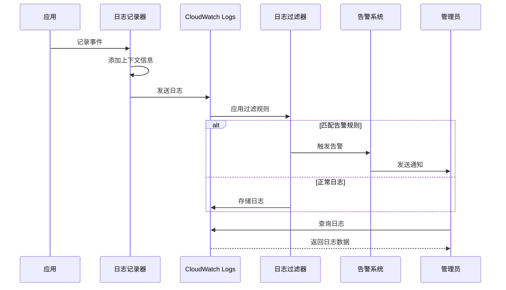
```mermaid
sequenceDiagram
    participant App as 应用
    participant Logger as 日志记录器
    participant CW as CloudWatch Logs
    participant Filter as 日志过滤器
    participant Alert as 告警系统
    participant Admin as 管理员
    
    App->>Logger: 记录事件
    Logger->>Logger: 添加上下文信息
    Logger->>CW: 发送日志
    CW->>Filter: 应用过滤规则
    
    alt 匹配告警规则
        Filter->>Alert: 触发告警
        Alert->>Admin: 发送通知
    else 正常日志
        Filter->>CW: 存储日志
    end
    
    Admin->>CW: 查询日志
    CW-->>Admin: 返回日志数据
```

### 应用监控

1. **CloudWatch指标**
   - API调用次数和延迟
   - 错误率
   - 用户活跃度

2. **用户体验监控**
   - 页面加载时间
   - API响应时间
   - 错误追踪

### 日志记录

1. **应用日志**
   - 用户操作日志
   - 错误日志
   - 性能日志

2. **安全日志**
   - 登录尝试
   - 授权失败
   - 异常访问模式

### 告警规则

```mermaid
graph TB
    subgraph Critical["严重告警"]
        C1["错误率 > 5%"]
        C2["API延迟 > 3秒"]
        C3["服务不可用"]
    end
    
    subgraph Warning["警告告警"]
        W1["错误率 > 2%"]
        W2["API延迟 > 1秒"]
        W3["登录失败率 > 10%"]
    end
    
    subgraph Info["信息告警"]
        I1["用户注册峰值"]
        I2["存储使用率 > 80%"]
        I3["异常流量模式"]
    end
    
    Critical --> Immediate["立即通知"]
    Warning --> Schedule["定时汇总"]
    Info --> Daily["每日报告"]
    
    style Critical fill:#ff6b6b
    style Warning fill:#ffd93d
    style Info fill:#95e1d3
```

## 可扩展性

### 未来功能扩展

1. **社交登录**
   - Google登录
   - Facebook登录
   - Apple登录

2. **多因素认证**
   - SMS验证
   - TOTP验证

3. **个人资料增强**
   - 个人简介
   - 状态消息
   - 隐私设置

4. **消息功能**
   - 一对一聊天
   - 群组聊天
   - 实时通知

### 架构扩展性

1. **微服务化**
   - 将功能拆分为独立的Lambda函数
   - 使用EventBridge进行事件驱动架构

2. **多区域部署**
   - 使用DynamoDB全球表
   - S3跨区域复制
   - CloudFront全球分发

3. **性能优化**
   - 引入Redis缓存
   - 使用Lambda@Edge
   - 实现GraphQL订阅


## 可扩展性

### 功能扩展路线图

```mermaid
timeline
    title 功能扩展路线图
    section 第一阶段 (当前)
        用户注册登录 : 邮箱验证
                      : 密码认证
        个人资料管理 : 用户名编辑
                      : 头像上传
    section 第二阶段 (3个月)
        社交登录 : Google登录
                 : Facebook登录
                 : Apple登录
        增强资料 : 个人简介
                 : 状态消息
    section 第三阶段 (6个月)
        多因素认证 : SMS验证
                   : TOTP验证
        消息功能 : 一对一聊天
                 : 实时通知
    section 第四阶段 (12个月)
        高级功能 : 群组聊天
                 : 文件分享
                 : 语音消息
```

### 未来功能扩展

```mermaid
graph TB
    Current["当前功能"]
    
    subgraph Phase2["第二阶段扩展"]
        Social["社交登录"]
        Enhanced["增强资料"]
    end
    
    subgraph Phase3["第三阶段扩展"]
        MFA["多因素认证"]
        Messaging["消息功能"]
    end
    
    subgraph Phase4["第四阶段扩展"]
        Advanced["高级功能"]
    end
    
    Current --> Phase2
    Phase2 --> Phase3
    Phase3 --> Phase4
    
    Social --> S1["Google登录"]
    Social --> S2["Facebook登录"]
    Social --> S3["Apple登录"]
    
    Enhanced --> E1["个人简介"]
    Enhanced --> E2["状态消息"]
    Enhanced --> E3["隐私设置"]
    
    MFA --> M1["SMS验证"]
    MFA --> M2["TOTP验证"]
    
    Messaging --> MS1["一对一聊天"]
    Messaging --> MS2["实时通知"]
    
    Advanced --> A1["群组聊天"]
    Advanced --> A2["文件分享"]
    Advanced --> A3["语音消息"]
    
    style Current fill:#e1ffe1
    style Phase2 fill:#e1f5ff
    style Phase3 fill:#fff4e1
    style Phase4 fill:#ffe1f5
```

### 架构扩展性

```mermaid
graph TB
    subgraph Current["当前架构"]
        C1["单区域部署"]
        C2["DynamoDB单表"]
        C3["S3单桶"]
    end
    
    subgraph Microservices["微服务化"]
        M1["Lambda函数拆分"]
        M2["EventBridge事件"]
        M3["Step Functions编排"]
    end
    
    subgraph MultiRegion["多区域部署"]
        MR1["DynamoDB全球表"]
        MR2["S3跨区域复制"]
        MR3["CloudFront分发"]
    end
    
    subgraph Performance["性能优化"]
        P1["Redis缓存"]
        P2["Lambda@Edge"]
        P3["GraphQL订阅"]
    end
    
    Current --> Microservices
    Current --> MultiRegion
    Current --> Performance
    
    style Current fill:#e1ffe1
    style Microservices fill:#e1f5ff
    style MultiRegion fill:#fff4e1
    style Performance fill:#ffe1f5
```

### 多区域架构演进

```mermaid
graph TB
    subgraph Region1["美国东部 (us-east-1)"]
        CF1["CloudFront"]
        App1["Amplify App"]
        DDB1["DynamoDB"]
        S31["S3 Bucket"]
    end
    
    subgraph Region2["欧洲 (eu-west-1)"]
        App2["Amplify App"]
        DDB2["DynamoDB"]
        S32["S3 Bucket"]
    end
    
    subgraph Region3["亚太 (ap-southeast-1)"]
        App3["Amplify App"]
        DDB3["DynamoDB"]
        S33["S3 Bucket"]
    end
    
    Users["全球用户"] --> CF1
    CF1 --> App1
    CF1 --> App2
    CF1 --> App3
    
    DDB1 <-.->|全球表复制| DDB2
    DDB2 <-.->|全球表复制| DDB3
    DDB3 <-.->|全球表复制| DDB1
    
    S31 <-.->|跨区域复制| S32
    S32 <-.->|跨区域复制| S33
    
    style Region1 fill:#e1f5ff
    style Region2 fill:#fff4e1
    style Region3 fill:#ffe1f5
```

### 性能优化策略

```mermaid
graph LR
    subgraph Frontend["前端优化"]
        F1["图片压缩"]
        F2["代码分割"]
        F3["懒加载"]
        F4["缓存策略"]
    end
    
    subgraph Backend["后端优化"]
        B1["DynamoDB索引"]
        B2["AppSync缓存"]
        B3["Lambda预热"]
        B4["批量操作"]
    end
    
    subgraph CDN["CDN优化"]
        C1["CloudFront"]
        C2["边缘缓存"]
        C3["压缩传输"]
    end
    
    subgraph Cache["缓存层"]
        CA1["Redis缓存"]
        CA2["浏览器缓存"]
        CA3["API缓存"]
    end
    
    Frontend --> CDN
    Backend --> Cache
    CDN --> Cache
    
    style Frontend fill:#e1f5ff
    style Backend fill:#fff4e1
    style CDN fill:#ffe1f5
    style Cache fill:#e1ffe1
```
