# 设计文档

## 概述

本文档描述了LinkUp即时通讯应用中联系人管理功能的技术设计。该功能基于现有的AWS Amplify Gen2架构，扩展了用户搜索和联系人关系管理能力，为后续的聊天功能提供基础。

### 技术栈

- **前端框架**: React 19 + TypeScript
- **构建工具**: Vite 7
- **UI库**: AWS Amplify UI React + 自定义WhatsApp风格组件
- **后端服务**: AWS Amplify Gen2
  - **身份验证**: Amplify Auth (Amazon Cognito)
  - **数据存储**: Amplify Data (AWS AppSync + DynamoDB)
- **测试框架**: Vitest + fast-check (属性测试)
- **状态管理**: React Hooks + Context API

### 架构原则

1. **扩展现有架构**: 基于已有的用户管理系统扩展
2. **owner-based授权**: 确保用户只能访问自己的联系人数据
3. **性能优化**: 使用防抖、分页和索引优化搜索性能
4. **响应式设计**: 适配移动端和桌面端
5. **可测试性**: 设计可测试的API和组件

## 架构

### 系统架构图

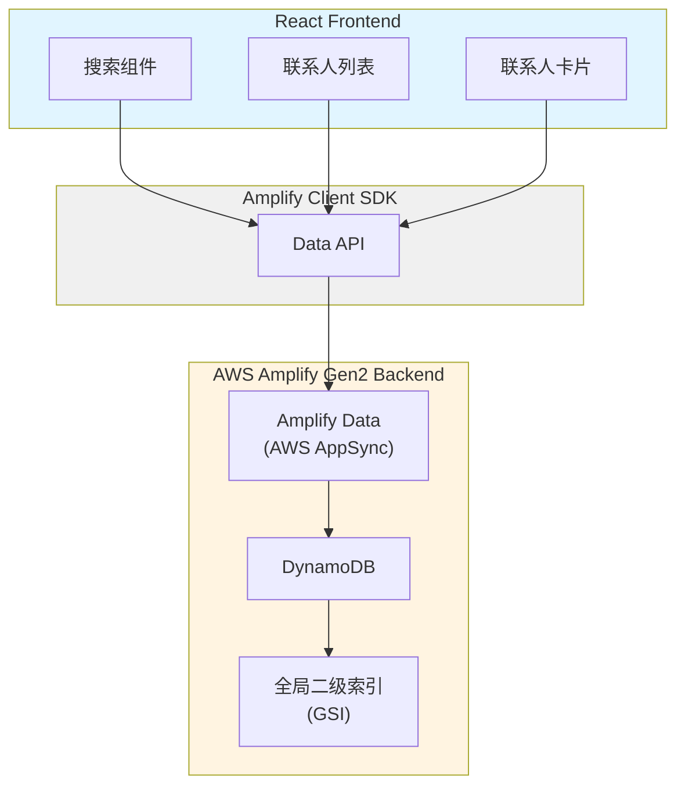

### 用户搜索流程

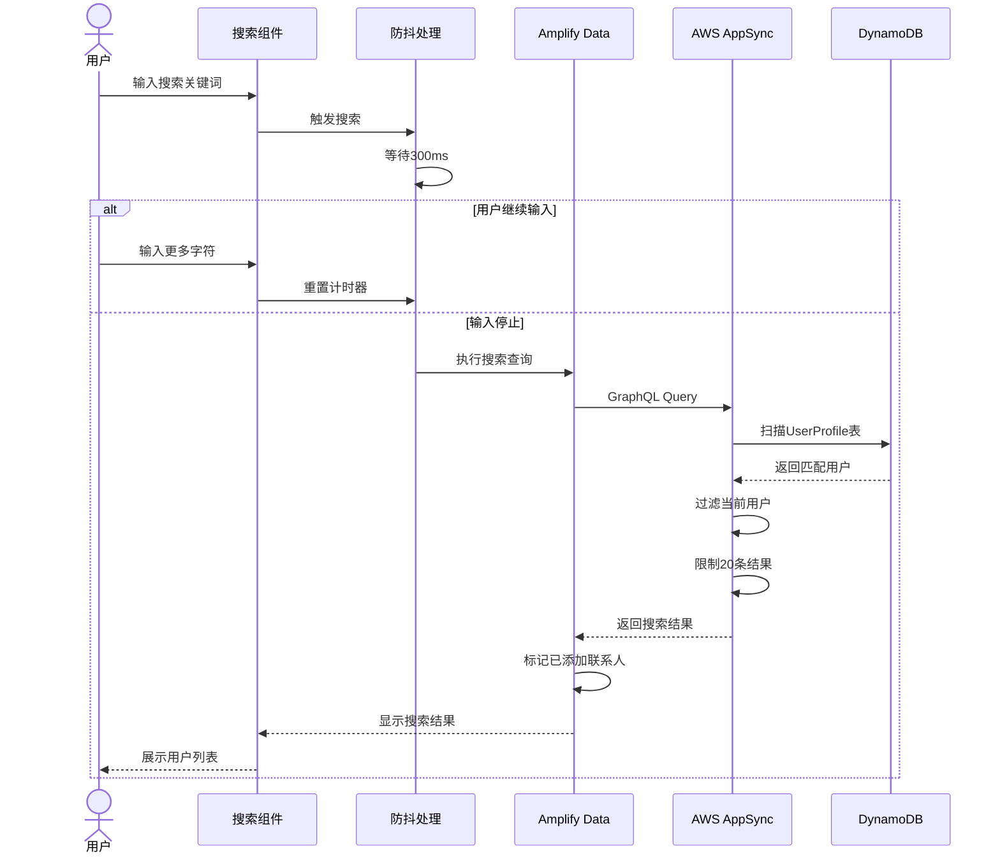

### 添加联系人流程

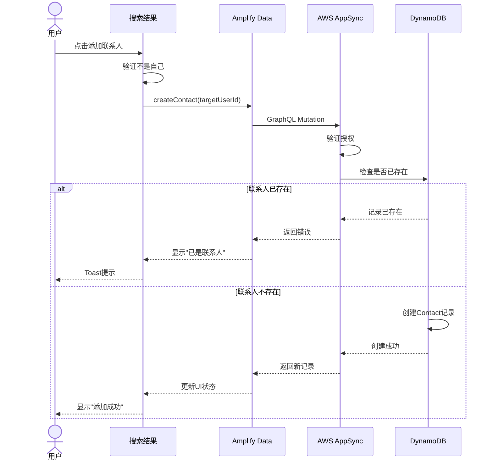

### 联系人列表流程

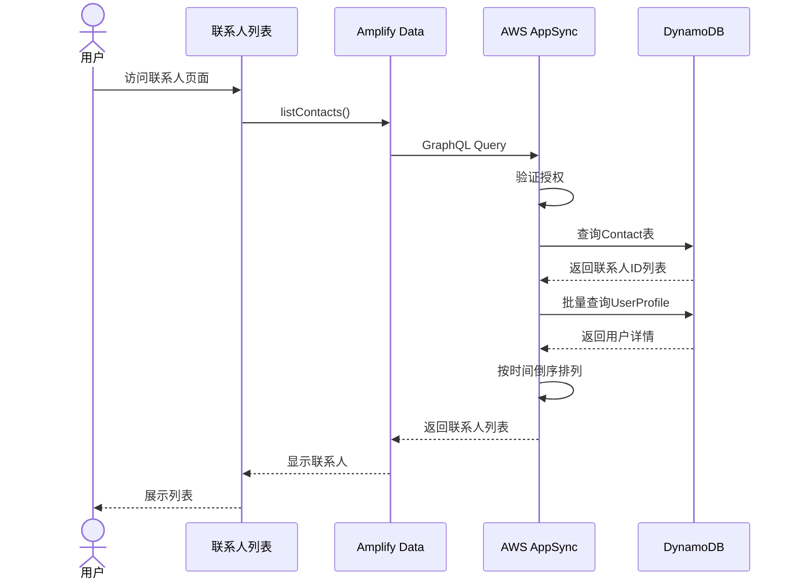

## 组件和接口

### 组件架构

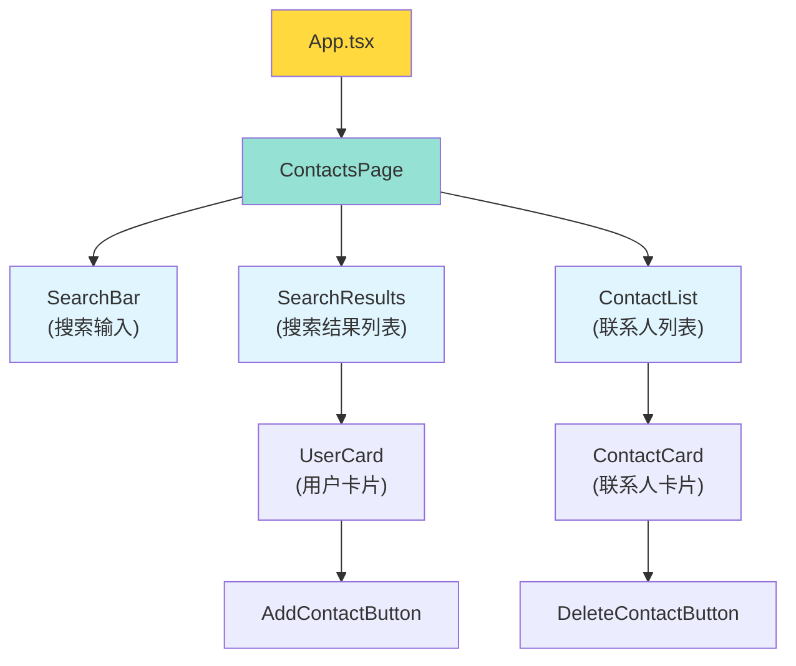

### 后端资源定义

#### 1. 数据模型扩展 (amplify/data/resource.ts)

```typescript
import { type ClientSchema, a, defineData } from '@aws-amplify/backend';

const schema = a.schema({
  // 现有的UserProfile模型
  UserProfile: a
    .model({
      userId: a.id().required(),
      username: a.string().required(),
      avatarUrl: a.string(),
      email: a.email().required(),
      createdAt: a.datetime(),
      updatedAt: a.datetime(),
    })
    .authorization((allow) => [
      allow.owner(),
      allow.authenticated().to(['read']), // 允许已认证用户搜索
    ]),
  
  // 新增的Contact模型
  Contact: a
    .model({
      userId: a.id().required(), // 当前用户ID
      contactUserId: a.id().required(), // 联系人用户ID
      contactUsername: a.string(), // 冗余存储，提高查询性能
      contactAvatarUrl: a.string(), // 冗余存储
      createdAt: a.datetime(),
    })
    .authorization((allow) => [
      allow.owner(), // 只有所有者可以访问
    ])
    .identifier(['userId', 'contactUserId']), // 复合主键
});

export type Schema = ClientSchema<typeof schema>;

export const data = defineData({
  schema,
  authorizationModes: {
    defaultAuthorizationMode: 'userPool',
  },
});
```

### 前端组件

#### 1. 联系人页面 (src/components/contacts/ContactsPage.tsx)

```typescript
interface ContactsPageProps {
  user: AuthUser;
}

function ContactsPage({ user }: ContactsPageProps) {
  const [searchQuery, setSearchQuery] = useState('');
  const [searchResults, setSearchResults] = useState<UserProfile[]>([]);
  const [contacts, setContacts] = useState<Contact[]>([]);
  const [isSearching, setIsSearching] = useState(false);
  const [isLoadingContacts, setIsLoadingContacts] = useState(true);

  // 加载联系人列表
  useEffect(() => {
    loadContacts();
  }, [user]);

  // 防抖搜索
  const debouncedSearch = useMemo(
    () => debounce((query: string) => {
      if (query.trim()) {
        searchUsers(query);
      } else {
        setSearchResults([]);
      }
    }, 300),
    []
  );

  // 搜索用户
  const searchUsers = async (query: string) => {
    setIsSearching(true);
    // 实现搜索逻辑
  };

  // 加载联系人
  const loadContacts = async () => {
    // 实现加载逻辑
  };

  // 添加联系人
  const addContact = async (targetUser: UserProfile) => {
    // 实现添加逻辑
  };

  // 删除联系人
  const deleteContact = async (contactId: string) => {
    // 实现删除逻辑
  };

  return (
    <div className="contacts-page">
      <SearchBar 
        value={searchQuery}
        onChange={(value) => {
          setSearchQuery(value);
          debouncedSearch(value);
        }}
        isSearching={isSearching}
      />
      
      {searchQuery && (
        <SearchResults 
          results={searchResults}
          contacts={contacts}
          onAddContact={addContact}
        />
      )}
      
      <ContactList 
        contacts={contacts}
        isLoading={isLoadingContacts}
        onDeleteContact={deleteContact}
      />
    </div>
  );
}
```

#### 2. 搜索栏组件 (src/components/contacts/SearchBar.tsx)

```typescript
interface SearchBarProps {
  value: string;
  onChange: (value: string) => void;
  isSearching: boolean;
}

function SearchBar({ value, onChange, isSearching }: SearchBarProps) {
  return (
    <div className="search-bar">
      <input
        type="text"
        placeholder="搜索用户名或邮箱..."
        value={value}
        onChange={(e) => onChange(e.target.value)}
        className="search-input"
      />
      {isSearching && <LoadingSpinner />}
    </div>
  );
}
```

#### 3. 用户卡片组件 (src/components/contacts/UserCard.tsx)

```typescript
interface UserCardProps {
  user: UserProfile;
  isContact: boolean;
  onAddContact: (user: UserProfile) => void;
}

function UserCard({ user, isContact, onAddContact }: UserCardProps) {
  return (
    <div className="user-card">
      
      <div className="user-info">
        <h3>{user.username}</h3>
        <p>{user.email}</p>
      </div>
      {isContact ? (
        <span className="badge">已添加</span>
      ) : (
        <button onClick={() => onAddContact(user)}>
          添加联系人
        </button>
      )}
    </div>
  );
}
```

### API接口

#### Amplify Data API

```typescript
import { generateClient } from 'aws-amplify/data';
import type { Schema } from '../amplify/data/resource';

const client = generateClient<Schema>();

// 搜索用户
async function searchUsers(query: string, currentUserId: string) {
  const { data } = await client.models.UserProfile.list({
    filter: {
      or: [
        { username: { contains: query } },
        { email: { contains: query } }
      ]
    },
    limit: 20
  });
  
  // 过滤掉当前用户
  return data.filter(user => user.userId !== currentUserId);
}

// 创建联系人
async function createContact(userId: string, targetUser: UserProfile) {
  return await client.models.Contact.create({
    userId: userId,
    contactUserId: targetUser.userId,
    contactUsername: targetUser.username,
    contactAvatarUrl: targetUser.avatarUrl,
    createdAt: new Date().toISOString(),
  });
}

// 查询联系人列表
async function listContacts(userId: string) {
  const { data } = await client.models.Contact.list({
    filter: { userId: { eq: userId } },
  });
  
  // 按创建时间倒序排列
  return data.sort((a, b) => 
    new Date(b.createdAt).getTime() - new Date(a.createdAt).getTime()
  );
}

// 删除联系人
async function deleteContact(userId: string, contactUserId: string) {
  return await client.models.Contact.delete({
    userId: userId,
    contactUserId: contactUserId,
  });
}

// 检查是否已是联系人
async function isContact(userId: string, targetUserId: string) {
  const { data } = await client.models.Contact.get({
    userId: userId,
    contactUserId: targetUserId,
  });
  return data !== null;
}
```

## 数据模型

### Contact 模型

```typescript
interface Contact {
  userId: string;              // 当前用户ID（分区键）
  contactUserId: string;       // 联系人用户ID（排序键）
  contactUsername: string;     // 联系人用户名（冗余）
  contactAvatarUrl?: string;   // 联系人头像URL（冗余）
  createdAt: string;           // 创建时间（ISO 8601）
  owner?: string;              // Amplify自动添加的所有者字段
}
```

### UserProfile 模型（扩展授权）

```typescript
interface UserProfile {
  id: string;              // DynamoDB生成的唯一ID
  userId: string;          // Cognito用户ID
  username: string;        // 用户名
  avatarUrl?: string;      // 头像URL
  email: string;           // 邮箱地址
  createdAt: string;       // 创建时间
  updatedAt: string;       // 更新时间
  owner?: string;          // 所有者字段
}
```

### 数据模型关系图

```mermaid
erDiagram
    USER_PROFILE ||--o{ CONTACT : "has many"
    USER_PROFILE ||--o{ CONTACT : "referenced by"
    
    USER_PROFILE {
        string id PK
        string userId UK
        string username
        string avatarUrl
        string email
        datetime createdAt
        datetime updatedAt
        string owner
    }
    
    CONTACT {
        string userId PK
        string contactUserId SK
        string contactUsername
        string contactAvatarUrl
        datetime createdAt
        string owner
    }
```

### 数据冗余策略

为了提高查询性能，Contact模型冗余存储了联系人的用户名和头像URL：

**优点**:
- 查询联系人列表时无需额外查询UserProfile表
- 减少API调用次数
- 提高列表加载速度

**缺点**:
- 当用户更新用户名或头像时，需要更新所有相关的Contact记录
- 增加存储空间

**权衡**: 考虑到联系人列表的查询频率远高于用户资料更新频率，这个权衡是合理的。

### 索引策略

**主键**: `userId` (分区键) + `contactUserId` (排序键)
- 支持高效查询某个用户的所有联系人
- 支持快速检查两个用户之间是否存在联系关系
- 防止重复添加同一个联系人

**查询模式**:
1. 查询用户A的所有联系人: `userId = A`
2. 检查用户A是否已添加用户B: `userId = A AND contactUserId = B`
3. 删除联系人关系: `userId = A AND contactUserId = B`

## 正确性属性

*属性是一个特征或行为，应该在系统的所有有效执行中保持为真——本质上是关于系统应该做什么的形式化陈述。属性作为人类可读规范和机器可验证正确性保证之间的桥梁。*

基于需求文档中的验收标准和prework分析，我们识别出以下可测试的正确性属性：

### 属性 1: 搜索返回匹配结果
*对于任何*搜索关键词和用户数据集，搜索结果中的所有用户的用户名或邮箱都应该包含该关键词
**验证需求: 1.1, 1.2, 1.3**

### 属性 2: 搜索结果限制20条
*对于任何*搜索查询，即使匹配结果超过20个用户，返回的结果数量也不应超过20条
**验证需求: 1.5**

### 属性 3: 搜索结果排除当前用户
*对于任何*搜索查询和当前用户，搜索结果中不应包含当前用户自己
**验证需求: 1.6**

### 属性 4: 搜索结果正确标记已添加联系人
*对于任何*搜索结果和当前用户的联系人列表，如果搜索结果中的用户已在联系人列表中，该用户应该被标记为已添加状态
**验证需求: 1.7**

### 属性 5: 添加联系人创建记录
*对于任何*有效的目标用户，添加联系人后应该能够在联系人列表中查询到该联系人
**验证需求: 2.1**

### 属性 6: 重复添加被拒绝
*对于任何*已存在的联系人关系，再次尝试添加相同的联系人应该被拒绝并返回错误
**验证需求: 2.2**

### 属性 7: 添加联系人更新UI状态
*对于任何*成功添加的联系人，该用户在搜索结果中的状态应该立即更新为已添加
**验证需求: 2.4**

### 属性 8: 联系人记录包含时间戳
*对于任何*新创建的联系人关系，记录中应该包含有效的创建时间戳
**验证需求: 2.5**

### 属性 9: 联系人列表完整性
*对于任何*用户，查询联系人列表应该返回该用户添加的所有联系人
**验证需求: 3.1**

### 属性 10: 联系人信息完整性
*对于任何*联系人记录，应该包含联系人的用户名和头像URL字段
**验证需求: 3.3**

### 属性 11: 联系人列表按时间倒序
*对于任何*联系人列表，列表中的联系人应该按创建时间倒序排列（最新添加的在前）
**验证需求: 3.4**

### 属性 12: 删除联系人移除记录
*对于任何*存在的联系人关系，删除后应该无法在联系人列表中查询到该联系人
**验证需求: 4.2, 4.3**

### 属性 13: 删除后状态更新
*对于任何*被删除的联系人，在搜索结果中该用户的状态应该更新为未添加
**验证需求: 4.4**

### 属性 14: 用户只能访问自己的联系人
*对于任何*两个不同的用户A和B，用户A查询联系人列表时不应该看到用户B的联系人
**验证需求: 5.1, 5.2**

### 属性 15: 用户只能为自己添加联系人
*对于任何*用户A和目标用户C，添加联系人操作应该只能创建userId为A的Contact记录
**验证需求: 5.3**

### 属性 16: 用户只能删除自己的联系人
*对于任何*用户A，删除联系人操作应该只能删除userId为A的Contact记录
**验证需求: 5.4**

### 属性 17: 防抖机制减少请求
*对于任何*快速连续的输入操作，防抖机制应该确保只发送最后一次搜索请求
**验证需求: 7.2, 7.3**

### 属性反思

在完成初步的属性识别后，我们进行了属性反思以消除冗余：

**合并的属性**:
- 属性1合并了1.1、1.2、1.3，因为它们都是验证搜索匹配的正确性
- 属性12合并了4.2和4.3，因为删除记录和从列表移除是同一个操作的两个方面
- 属性14合并了5.1和5.2，因为它们都是验证访问隔离
- 属性17合并了7.2和7.3，因为它们都是验证防抖机制

**保留的独立属性**:
- 属性4（标记已添加）和属性7（更新UI状态）虽然相似，但一个是查询时的标记，一个是添加后的状态更新，提供不同的验证价值
- 属性5（创建记录）和属性9（列表完整性）虽然相关，但一个验证单个添加操作，一个验证整体列表查询

最终我们得到17个独立的、有价值的正确性属性。

## 错误处理

### 错误类型

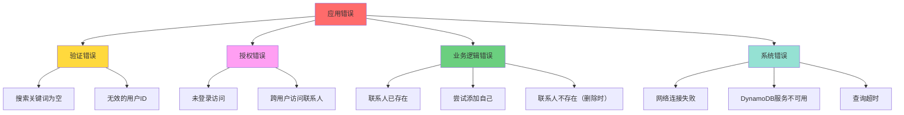

### 错误处理策略

```typescript
// 错误处理工具函数
function handleContactError(error: any, operation: string) {
  if (error.errors) {
    error.errors.forEach((err: any) => {
      if (err.errorType === 'Unauthorized') {
        showToast('您没有权限执行此操作', 'error');
      } else if (err.errorType === 'ConditionalCheckFailedException') {
        if (operation === 'add') {
          showToast('该用户已是您的联系人', 'warning');
        } else if (operation === 'delete') {
          showToast('联系人不存在', 'warning');
        }
      } else if (err.errorType === 'ValidationException') {
        showToast('输入数据无效', 'error');
      }
    });
  } else {
    showToast('操作失败，请稍后重试', 'error');
  }
}

// 在组件中使用
const addContact = async (targetUser: UserProfile) => {
  try {
    // 前端验证
    if (targetUser.userId === user.userId) {
      showToast('不能添加自己为联系人', 'warning');
      return;
    }
    
    // 检查是否已存在
    const exists = await isContact(user.userId, targetUser.userId);
    if (exists) {
      showToast('该用户已是您的联系人', 'warning');
      return;
    }
    
    // 执行添加
    await createContact(user.userId, targetUser);
    showToast('添加成功', 'success');
    
    // 更新本地状态
    setContacts([...contacts, newContact]);
  } catch (error) {
    handleContactError(error, 'add');
  }
};
```

### 用户友好的错误消息

| 错误类型 | 技术消息 | 用户消息 |
|---------|---------|---------|
| 联系人已存在 | `ConditionalCheckFailedException` | "该用户已是您的联系人" |
| 尝试添加自己 | `ValidationException` | "不能添加自己为联系人" |
| 联系人不存在 | `ResourceNotFoundException` | "联系人不存在" |
| 授权失败 | `UnauthorizedException` | "您没有权限执行此操作" |
| 搜索关键词为空 | `ValidationException` | "请输入搜索关键词" |
| 网络错误 | `NetworkError` | "网络连接失败，请检查网络" |
| 查询超时 | `TimeoutException` | "请求超时，请稍后重试" |

## 测试策略

### 测试金字塔

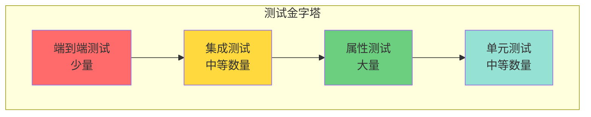

### 单元测试

单元测试用于验证特定的功能点和边界情况：

1. **输入验证测试**
   - 测试空白搜索关键词处理
   - 测试无效用户ID处理

2. **边界情况测试**
   - 测试添加自己为联系人
   - 测试重复添加联系人
   - 测试删除不存在的联系人
   - 测试搜索结果恰好20条

3. **工具函数测试**
   - 测试防抖函数
   - 测试日期排序函数
   - 测试状态标记函数

### 属性测试

属性测试用于验证系统在各种输入下的通用正确性：

**测试框架**: 使用 `fast-check` 库进行属性测试

**配置**: 每个属性测试至少运行100次迭代

**标记格式**: 每个属性测试必须使用注释标记对应的设计文档属性
```typescript
// **Feature: contact-management, Property 1: 搜索返回匹配结果**
```

**属性测试示例**:

```typescript
import fc from 'fast-check';

// **Feature: contact-management, Property 1: 搜索返回匹配结果**
test('Property 1: Search returns matching results', async () => {
  await fc.assert(
    fc.asyncProperty(
      fc.array(userProfileArbitrary(), { minLength: 5, maxLength: 30 }),
      fc.string({ minLength: 1, maxLength: 20 }),
      async (users, query) => {
        // 创建测试数据
        await seedUsers(users);
        
        // 执行搜索
        const results = await searchUsers(query, 'current-user-id');
        
        // 验证所有结果都匹配查询
        results.forEach(user => {
          const matches = 
            user.username.includes(query) || 
            user.email.includes(query);
          expect(matches).toBe(true);
        });
      }
    ),
    { numRuns: 100 }
  );
});

// **Feature: contact-management, Property 2: 搜索结果限制20条**
test('Property 2: Search results limited to 20', async () => {
  await fc.assert(
    fc.asyncProperty(
      fc.array(userProfileArbitrary(), { minLength: 25, maxLength: 50 }),
      fc.string({ minLength: 1 }),
      async (users, query) => {
        // 确保所有用户都匹配查询
        const matchingUsers = users.map(u => ({
          ...u,
          username: query + u.username
        }));
        
        await seedUsers(matchingUsers);
        const results = await searchUsers(query, 'current-user-id');
        
        expect(results.length).toBeLessThanOrEqual(20);
      }
    ),
    { numRuns: 100 }
  );
});

// **Feature: contact-management, Property 5: 添加联系人创建记录**
test('Property 5: Adding contact creates record', async () => {
  await fc.assert(
    fc.asyncProperty(
      fc.string(),
      userProfileArbitrary(),
      async (userId, targetUser) => {
        fc.pre(userId !== targetUser.userId); // 确保不是自己
        
        await createContact(userId, targetUser);
        const contacts = await listContacts(userId);
        
        const found = contacts.some(c => 
          c.contactUserId === targetUser.userId
        );
        expect(found).toBe(true);
      }
    ),
    { numRuns: 100 }
  );
});

// **Feature: contact-management, Property 11: 联系人列表按时间倒序**
test('Property 11: Contacts sorted by time descending', async () => {
  await fc.assert(
    fc.asyncProperty(
      fc.string(),
      fc.array(userProfileArbitrary(), { minLength: 3, maxLength: 10 }),
      async (userId, targetUsers) => {
        // 按顺序添加联系人
        for (const user of targetUsers) {
          await createContact(userId, user);
          await sleep(10); // 确保时间戳不同
        }
        
        const contacts = await listContacts(userId);
        
        // 验证按时间倒序
        for (let i = 0; i < contacts.length - 1; i++) {
          const current = new Date(contacts[i].createdAt);
          const next = new Date(contacts[i + 1].createdAt);
          expect(current.getTime()).toBeGreaterThanOrEqual(next.getTime());
        }
      }
    ),
    { numRuns: 100 }
  );
});

// **Feature: contact-management, Property 14: 用户只能访问自己的联系人**
test('Property 14: Users can only access their own contacts', async () => {
  await fc.assert(
    fc.asyncProperty(
      fc.tuple(fc.string(), fc.string()).filter(([a, b]) => a !== b),
      fc.array(userProfileArbitrary(), { minLength: 2 }),
      async ([userA, userB], targetUsers) => {
        // 用户A添加联系人
        for (const user of targetUsers) {
          await createContact(userA, user);
        }
        
        // 用户B查询联系人列表
        const contactsB = await listContacts(userB);
        
        // 用户B不应该看到用户A的联系人
        expect(contactsB.length).toBe(0);
      }
    ),
    { numRuns: 100 }
  );
});
```

### 集成测试

集成测试验证多个组件之间的交互：

1. **完整搜索流程**
   - 输入搜索关键词 → 防抖 → 发送请求 → 显示结果

2. **完整添加流程**
   - 搜索用户 → 点击添加 → 创建记录 → 更新UI → 显示Toast

3. **完整删除流程**
   - 查看联系人列表 → 点击删除 → 确认 → 删除记录 → 更新列表

### 端到端测试

使用Cypress或Playwright进行E2E测试：

1. 用户搜索和添加联系人流程
2. 用户查看和删除联系人流程
3. 多用户场景下的数据隔离验证

## 性能考虑

### 前端优化

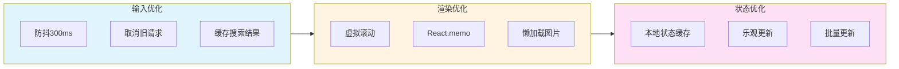

1. **搜索优化**
   - 防抖处理（300ms延迟）
   - 取消未完成的旧请求
   - 缓存最近的搜索结果

2. **渲染优化**
   - 使用React.memo避免不必要的重渲染
   - 虚拟滚动处理大量搜索结果
   - 图片懒加载

3. **状态管理优化**
   - 本地缓存联系人列表
   - 乐观更新UI（添加/删除时）
   - 批量更新状态

### 后端优化

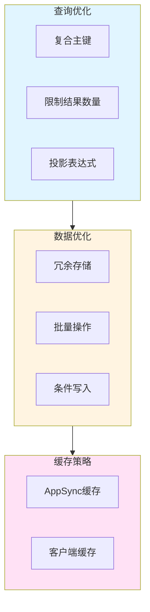

1. **DynamoDB优化**
   - 使用复合主键（userId + contactUserId）提高查询效率
   - 冗余存储用户名和头像，减少联表查询
   - 使用条件表达式防止重复添加

2. **查询优化**
   - 限制搜索结果数量（最多20条）
   - 使用投影表达式只返回需要的字段
   - 批量查询用户详情

3. **缓存策略**
   - 启用AppSync缓存
   - 客户端缓存联系人列表
   - 设置合理的缓存过期时间

### 性能指标

| 操作 | 目标响应时间 | 优化策略 |
|------|------------|---------|
| 搜索用户 | < 500ms | 防抖、限制结果、索引 |
| 添加联系人 | < 300ms | 乐观更新、条件写入 |
| 加载联系人列表 | < 400ms | 冗余存储、缓存 |
| 删除联系人 | < 300ms | 乐观更新、复合主键 |

## 安全考虑

### 授权架构

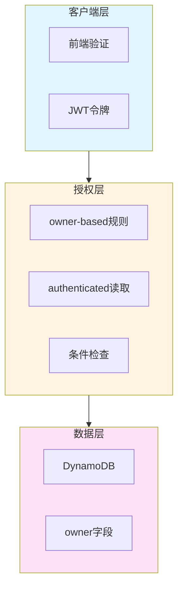

### 数据访问控制

1. **UserProfile访问控制**
   - 所有者可以读写自己的资料
   - 已认证用户可以读取其他用户的资料（用于搜索）
   - 未认证用户无法访问

2. **Contact访问控制**
   - 只有所有者可以访问自己的联系人列表
   - 只有所有者可以添加/删除自己的联系人
   - 跨用户访问被拒绝

### 授权验证流程

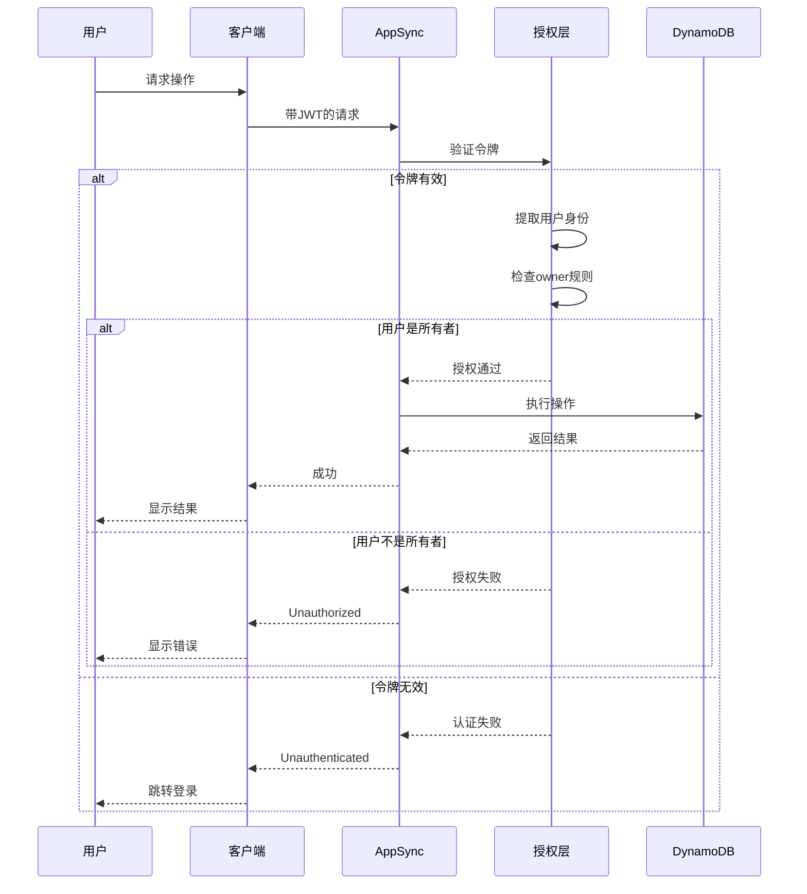

### 输入验证

1. **前端验证**
   - 搜索关键词非空验证
   - 用户ID格式验证
   - 防止添加自己为联系人

2. **后端验证**
   - Amplify Data的schema验证
   - 条件表达式防止重复添加
   - owner字段自动验证

### 安全最佳实践

1. **防止数据泄露**
   - 搜索结果不包含敏感信息（如完整邮箱）
   - 联系人列表只返回必要字段
   - 错误消息不泄露系统信息

2. **防止滥用**
   - 搜索结果限制20条
   - 防抖机制限制请求频率
   - 考虑添加速率限制（未来）

3. **审计日志**
   - 记录联系人添加/删除操作
   - 记录异常访问尝试
   - 使用CloudWatch监控

## 部署策略

### 增量部署

由于这是对现有系统的扩展，我们采用增量部署策略：

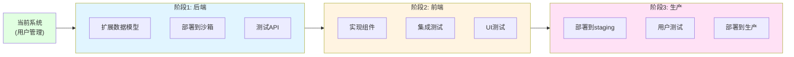

### 部署步骤

1. **阶段1: 后端扩展**
   - 更新 `amplify/data/resource.ts` 添加Contact模型
   - 更新UserProfile授权规则
   - 部署到沙箱环境测试
   - 验证API功能

2. **阶段2: 前端开发**
   - 实现联系人管理组件
   - 编写单元测试和属性测试
   - 本地测试完整流程

3. **阶段3: 生产部署**
   - 部署到staging环境
   - 进行集成测试和E2E测试
   - 用户验收测试
   - 部署到生产环境

### 回滚策略

如果部署出现问题：

1. **数据模型回滚**
   - Contact模型是新增的，可以安全删除
   - UserProfile的授权变更可以回滚

2. **前端回滚**
   - 使用Git回滚到上一个稳定版本
   - Amplify Hosting支持快速回滚

3. **数据迁移**
   - Contact表是新表，没有历史数据
   - 不需要数据迁移

## 监控和日志

### 关键指标

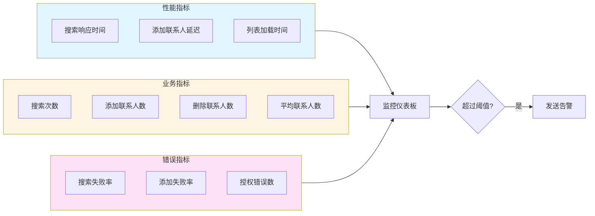

### CloudWatch指标

1. **性能指标**
   - 搜索API响应时间
   - 添加/删除操作延迟
   - DynamoDB读写延迟

2. **业务指标**
   - 每日搜索次数
   - 每日添加联系人数
   - 活跃用户数
   - 平均每用户联系人数

3. **错误指标**
   - API错误率
   - 授权失败次数
   - 超时次数

### 日志记录

```typescript
// 日志工具函数
function logContactOperation(
  operation: 'search' | 'add' | 'delete',
  userId: string,
  details: any
) {
  console.log({
    timestamp: new Date().toISOString(),
    operation,
    userId,
    details,
  });
}

// 使用示例
await logContactOperation('add', user.userId, {
  targetUserId: targetUser.userId,
  success: true,
});
```

### 告警规则

| 指标 | 阈值 | 告警级别 |
|------|------|---------|
| 搜索失败率 | > 5% | 严重 |
| 添加失败率 | > 3% | 警告 |
| 搜索响应时间 | > 1秒 | 警告 |
| 授权错误数 | > 100/小时 | 严重 |

## 可扩展性

### 未来功能扩展

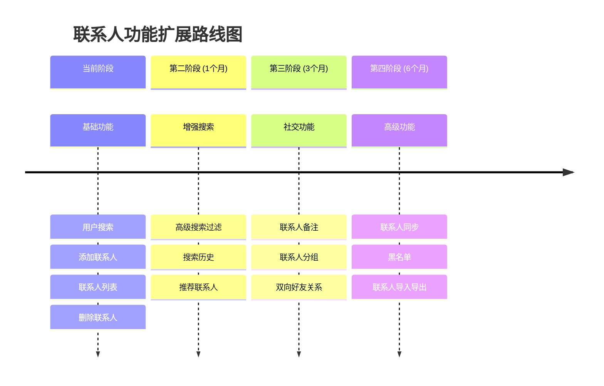

### 架构扩展点

1. **双向好友关系**
   - 当前是单向关系（A添加B，B不知道）
   - 未来可扩展为双向好友（需要B确认）
   - 添加FriendRequest模型

2. **联系人分组**
   - 添加ContactGroup模型
   - 支持将联系人分组管理
   - 支持群组聊天

3. **推荐系统**
   - 基于共同联系人推荐
   - 基于用户行为推荐
   - 使用Lambda函数实现推荐算法

4. **搜索增强**
   - 使用OpenSearch实现全文搜索
   - 支持模糊搜索和拼音搜索
   - 搜索结果排序优化

### 性能扩展

1. **缓存层**
   - 引入Redis缓存热门搜索
   - 缓存用户的联系人列表
   - 减少DynamoDB读取

2. **搜索优化**
   - 使用OpenSearch替代DynamoDB扫描
   - 实现搜索索引
   - 支持更复杂的查询

3. **数据分片**
   - 当用户量增长时考虑分片
   - 使用DynamoDB的分区键优化
   - 考虑多区域部署
