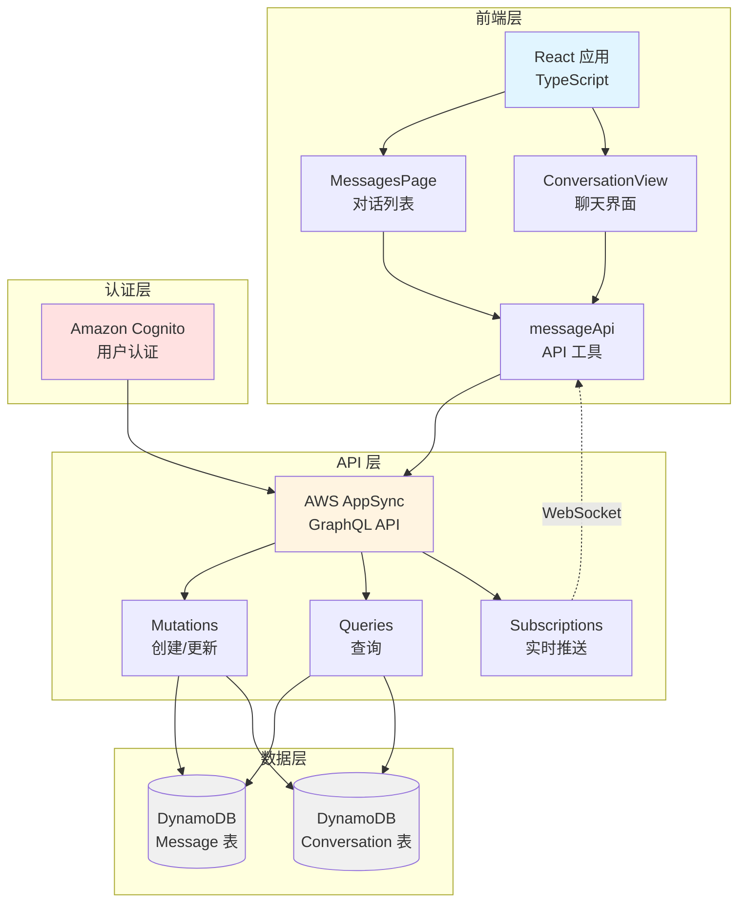
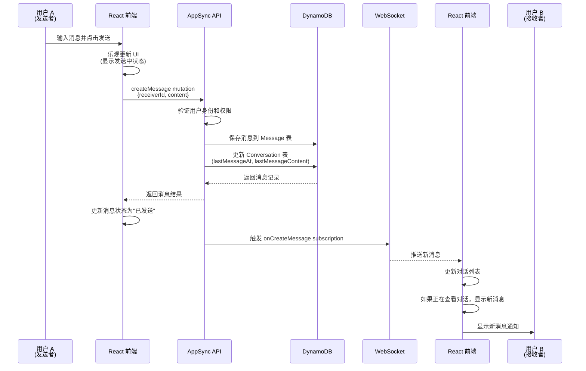
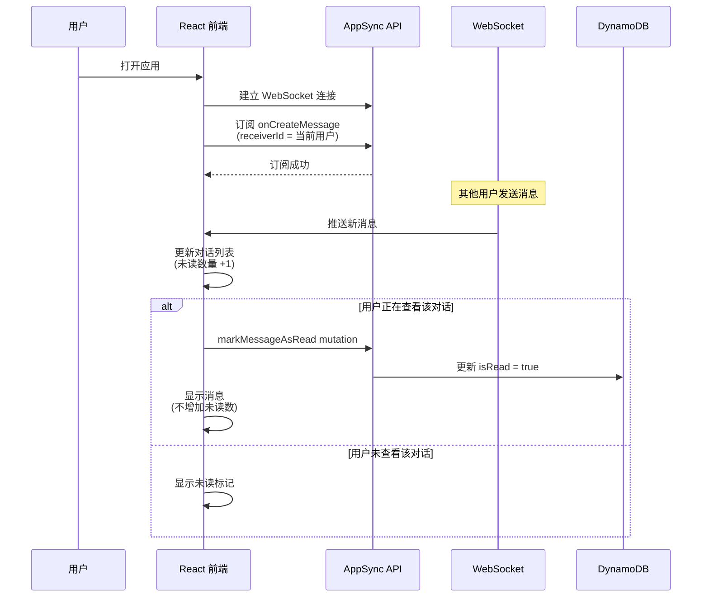
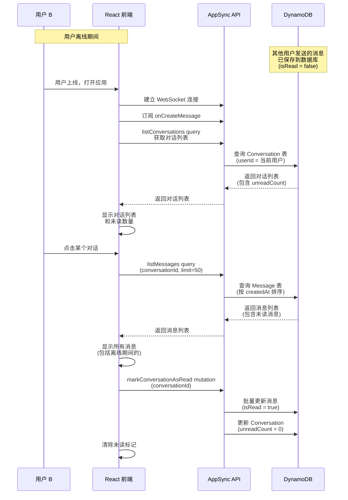
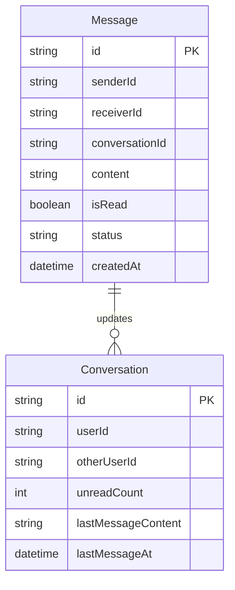
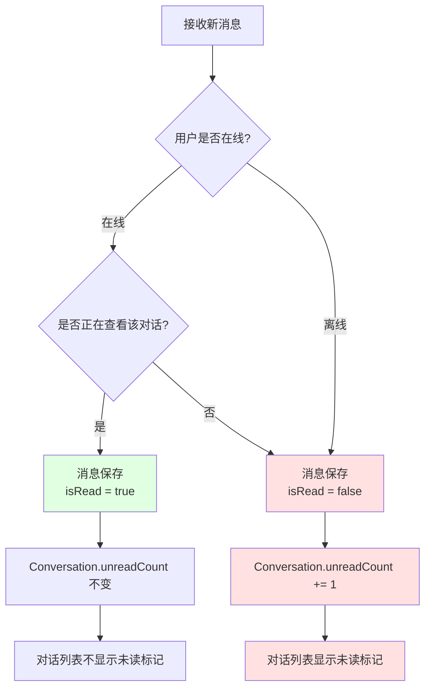
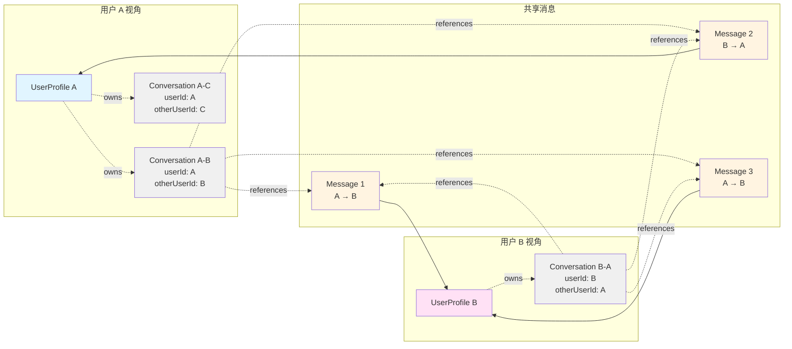

# 设计文档

## 概述

本文档描述了 LinkUp 即时通讯应用中一对一消息功能的技术设计。该功能基于 AWS Amplify Gen2 构建，使用 AWS AppSync GraphQL API 和 DynamoDB 实现消息的存储和实时传输。

消息系统的核心是两个数据模型：Message（消息）和 Conversation（对话）。通过 GraphQL subscriptions 实现实时消息推送，通过 owner-based 和 custom authorization 确保数据安全。

## 架构

### 整体架构



### 数据流

#### 发送消息流程



#### 接收消息流程（在线）



#### 离线消息处理流程



### 离线消息技术方案

#### 核心原理

离线消息的实现不依赖于特殊的"离线消息队列"，而是利用 DynamoDB 的持久化存储和 GraphQL 查询机制：

1. **消息持久化：** 所有消息都保存在 DynamoDB，无论接收者是否在线
2. **未读标记：** 每条消息有 `isRead` 字段，默认为 `false`
3. **上线拉取：** 用户上线时通过 GraphQL query 查询未读消息
4. **实时订阅：** 上线后通过 subscription 接收新消息

#### 数据结构设计



**关键字段说明：**
- `Message.isRead`: 标记消息是否已读，离线消息默认为 `false`
- `Conversation.unreadCount`: 缓存未读数量，避免每次都计算
- `Message.conversationId`: 用于快速查询某个对话的所有消息

#### 离线消息拉取策略

**策略 1: 对话列表加载时**

```typescript
// 用户打开应用时
async function loadConversations() {
  // 1. 查询所有对话（包含未读数量）
  const conversations = await client.models.Conversation.list({
    filter: { userId: { eq: currentUserId } },
    sortDirection: 'DESC',
    sortBy: 'lastMessageAt'
  });
  
  // 2. 对话列表会显示每个对话的未读数量
  // unreadCount 字段已经在发送消息时更新
  return conversations;
}
```

**策略 2: 打开对话时**

```typescript
// 用户点击某个对话时
async function loadMessages(conversationId: string) {
  // 1. 查询该对话的所有消息（包括未读的）
  const messages = await client.models.Message.list({
    filter: { conversationId: { eq: conversationId } },
    sortDirection: 'ASC',
    sortBy: 'createdAt',
    limit: 50  // 只加载最近50条
  });
  
  // 2. 标记所有未读消息为已读
  await markConversationAsRead(conversationId);
  
  return messages;
}
```

#### 未读数量维护



**实现细节：**

```typescript
// 发送消息时更新接收者的对话未读数
async function createMessage(receiverId: string, content: string) {
  // 1. 创建消息
  const message = await client.models.Message.create({
    senderId: currentUserId,
    receiverId,
    content,
    conversationId: generateConversationId(currentUserId, receiverId),
    isRead: false,  // 默认未读
    status: 'sent'
  });
  
  // 2. 更新发送者的对话记录
  await updateConversation(currentUserId, receiverId, {
    lastMessageContent: content,
    lastMessageAt: new Date().toISOString()
  });
  
  // 3. 更新接收者的对话记录（增加未读数）
  const receiverConvId = generateConversationId(receiverId, currentUserId);
  const receiverConv = await getOrCreateConversation(receiverId, currentUserId);
  
  await client.models.Conversation.update({
    id: receiverConvId,
    unreadCount: (receiverConv.unreadCount || 0) + 1,
    lastMessageContent: content,
    lastMessageAt: new Date().toISOString()
  });
  
  return message;
}

// 查看对话时标记为已读
async function markConversationAsRead(conversationId: string) {
  // 1. 批量更新该对话的所有未读消息
  const unreadMessages = await client.models.Message.list({
    filter: {
      conversationId: { eq: conversationId },
      isRead: { eq: false },
      receiverId: { eq: currentUserId }
    }
  });
  
  // 2. 批量更新为已读
  await Promise.all(
    unreadMessages.map(msg => 
      client.models.Message.update({
        id: msg.id,
        isRead: true
      })
    )
  );
  
  // 3. 重置对话的未读数量
  await client.models.Conversation.update({
    id: conversationId,
    unreadCount: 0
  });
}
```

#### 性能优化

**问题：** 每次打开对话都要批量更新消息的 `isRead` 字段，可能影响性能。

**优化方案：**

1. **客户端缓存：** 使用 React Query 缓存已读状态，避免重复更新
2. **批量操作：** 使用 DynamoDB 的 BatchWriteItem 批量更新
3. **异步更新：** 标记已读操作异步执行，不阻塞消息显示
4. **懒加载：** 只在用户滚动到未读消息时才标记已读

```typescript
// 优化后的标记已读逻辑
async function markConversationAsRead(conversationId: string) {
  // 异步执行，不阻塞 UI
  setTimeout(async () => {
    try {
      // 使用事务或批量操作
      await batchUpdateMessages(conversationId);
    } catch (error) {
      console.error('Failed to mark as read:', error);
      // 失败不影响用户体验，下次打开会重试
    }
  }, 0);
}
```

## 组件和接口

### 数据模型

#### Message 模型

```typescript
type Message = {
  id: string;                    // 消息唯一标识
  senderId: string;              // 发送者用户ID
  receiverId: string;            // 接收者用户ID
  content: string;               // 消息内容（最大5000字符）
  conversationId: string;        // 所属对话ID
  status: 'sending' | 'sent' | 'failed';  // 消息状态
  isRead: boolean;               // 是否已读
  createdAt: string;             // 创建时间（ISO 8601）
  updatedAt: string;             // 更新时间（ISO 8601）
}
```

**授权规则：**
- 发送者可以创建、读取、更新自己发送的消息
- 接收者可以读取、更新（标记已读）接收的消息
- 使用 custom authorization 实现双向访问控制

#### Conversation 模型

```typescript
type Conversation = {
  id: string;                    // 对话唯一标识
  userId: string;                // 当前用户ID（owner）
  otherUserId: string;           // 对方用户ID
  otherUserName: string;         // 对方用户名（冗余字段，提升查询性能）
  otherUserAvatar: string;       // 对方头像URL（冗余字段）
  lastMessageContent: string;    // 最后一条消息内容预览
  lastMessageAt: string;         // 最后消息时间（ISO 8601）
  unreadCount: number;           // 未读消息数量
  createdAt: string;             // 创建时间（ISO 8601）
  updatedAt: string;             // 更新时间（ISO 8601）
}
```

**授权规则：**
- 使用 owner-based authorization
- 每个用户只能访问自己的对话记录（userId = 当前用户）

**设计说明：**
- Conversation 是单向的，每个用户维护自己的对话列表
- 冗余存储对方用户信息，避免频繁关联查询 UserProfile
- unreadCount 在前端计算并更新，简化后端逻辑

### GraphQL Schema

#### 完整 Schema 定义

```graphql
# Message 类型定义
type Message @model
  @auth(rules: [
    # 发送者可以读取和更新自己发送的消息
    { allow: owner, ownerField: "senderId", operations: [read, update] }
    # 接收者可以读取和更新接收的消息
    { allow: owner, ownerField: "receiverId", operations: [read, update] }
  ]) {
  id: ID!
  senderId: String! @index(name: "bySender", sortKeyFields: ["createdAt"])
  receiverId: String! @index(name: "byReceiver", sortKeyFields: ["createdAt"])
  conversationId: String! @index(name: "byConversation", sortKeyFields: ["createdAt"])
  content: String!
  status: MessageStatus!
  isRead: Boolean!
  createdAt: AWSDateTime!
  updatedAt: AWSDateTime!
}

# 消息状态枚举
enum MessageStatus {
  sending
  sent
  failed
}

# Conversation 类型定义
type Conversation @model
  @auth(rules: [
    # 只有对话所有者可以访问
    { allow: owner, ownerField: "userId" }
  ]) {
  id: ID!
  userId: String! @index(name: "byUser", sortKeyFields: ["lastMessageAt"])
  otherUserId: String!
  otherUserName: String!
  otherUserAvatar: String
  lastMessageContent: String!
  lastMessageAt: AWSDateTime!
  unreadCount: Int!
  createdAt: AWSDateTime!
  updatedAt: AWSDateTime!
}

# 分页连接类型
type MessageConnection {
  items: [Message]
  nextToken: String
}

type ConversationConnection {
  items: [Conversation]
  nextToken: String
}
```

#### Mutations

```graphql
# 发送消息
mutation CreateMessage($input: CreateMessageInput!) {
  createMessage(input: $input) {
    id
    senderId
    receiverId
    conversationId
    content
    status
    isRead
    createdAt
  }
}

# 标记消息为已读
mutation MarkMessageAsRead($id: ID!) {
  updateMessage(input: { id: $id, isRead: true }) {
    id
    isRead
    updatedAt
  }
}

# 更新对话
mutation UpdateConversation($input: UpdateConversationInput!) {
  updateConversation(input: $input) {
    id
    unreadCount
    lastMessageContent
    lastMessageAt
    updatedAt
  }
}
```

#### Queries

```graphql
# 获取对话列表
query ListConversations($userId: String!, $limit: Int, $nextToken: String) {
  listConversations(
    filter: { userId: { eq: $userId } }
    limit: $limit
    nextToken: $nextToken
    sortDirection: DESC
  ) {
    items {
      id
      userId
      otherUserId
      otherUserName
      otherUserAvatar
      lastMessageContent
      lastMessageAt
      unreadCount
    }
    nextToken
  }
}

# 获取对话消息历史
query ListMessages($conversationId: String!, $limit: Int, $nextToken: String) {
  listMessages(
    filter: { conversationId: { eq: $conversationId } }
    limit: $limit
    nextToken: $nextToken
    sortDirection: ASC
  ) {
    items {
      id
      senderId
      receiverId
      content
      status
      isRead
      createdAt
    }
    nextToken
  }
}

# 获取单个对话
query GetConversation($id: ID!) {
  getConversation(id: $id) {
    id
    userId
    otherUserId
    otherUserName
    otherUserAvatar
    lastMessageContent
    lastMessageAt
    unreadCount
  }
}
```

#### Subscriptions

```graphql
# 订阅新消息（接收者）
subscription OnCreateMessage($receiverId: String!) {
  onCreateMessage(filter: { receiverId: { eq: $receiverId } }) {
    id
    senderId
    receiverId
    conversationId
    content
    status
    isRead
    createdAt
  }
}

# 订阅消息更新（发送者）
subscription OnUpdateMessage($senderId: String!) {
  onUpdateMessage(filter: { senderId: { eq: $senderId } }) {
    id
    status
    isRead
    updatedAt
  }
}

# 订阅对话更新
subscription OnUpdateConversation($userId: String!) {
  onUpdateConversation(filter: { userId: { eq: $userId } }) {
    id
    unreadCount
    lastMessageContent
    lastMessageAt
    updatedAt
  }
}
```

#### Amplify Gen2 TypeScript 定义

```typescript
import { type ClientSchema, a, defineData } from '@aws-amplify/backend';

const schema = a.schema({
  Message: a
    .model({
      senderId: a.string().required(),
      receiverId: a.string().required(),
      conversationId: a.string().required(),
      content: a.string().required(),
      status: a.enum(['sending', 'sent', 'failed']),
      isRead: a.boolean().default(false),
    })
    .authorization(allow => [
      allow.owner().inField('senderId').to(['read', 'update']),
      allow.owner().inField('receiverId').to(['read', 'update']),
    ])
    .secondaryIndexes(index => [
      index('senderId').sortKeys(['createdAt']).name('bySender'),
      index('receiverId').sortKeys(['createdAt']).name('byReceiver'),
      index('conversationId').sortKeys(['createdAt']).name('byConversation'),
    ]),

  Conversation: a
    .model({
      userId: a.string().required(),
      otherUserId: a.string().required(),
      otherUserName: a.string().required(),
      otherUserAvatar: a.string(),
      lastMessageContent: a.string().required(),
      lastMessageAt: a.datetime().required(),
      unreadCount: a.integer().default(0),
    })
    .authorization(allow => [
      allow.ownerDefinedIn('userId'),
    ])
    .secondaryIndexes(index => [
      index('userId').sortKeys(['lastMessageAt']).name('byUser'),
    ]),
});

export type Schema = ClientSchema<typeof schema>;
export const data = defineData({ schema });
```

### React 组件

#### MessagesPage 组件

主消息页面，显示对话列表。

**Props:** 无

**State:**
- `conversations: Conversation[]` - 对话列表
- `loading: boolean` - 加载状态
- `totalUnread: number` - 总未读数

**功能:**
- 加载并显示对话列表
- 订阅新消息更新对话列表
- 点击对话进入聊天界面
- 显示总未读消息数

#### ConversationView 组件

单个对话的聊天界面。

**Props:**
- `conversationId: string` - 对话ID
- `otherUserId: string` - 对方用户ID

**State:**
- `messages: Message[]` - 消息列表
- `inputText: string` - 输入框内容
- `sending: boolean` - 发送状态
- `loading: boolean` - 加载状态

**功能:**
- 加载并显示消息历史
- 订阅新消息实时显示
- 发送文本消息
- 自动滚动到最新消息
- 标记消息为已读
- 支持 Enter 发送，Shift+Enter 换行

#### MessageBubble 组件

单条消息气泡。

**Props:**
- `message: Message` - 消息对象
- `isSent: boolean` - 是否是发送的消息

**功能:**
- 显示消息内容
- 显示时间戳
- 显示消息状态（发送中/已发送/失败）
- 区分发送和接收消息的样式

#### ConversationListItem 组件

对话列表项。

**Props:**
- `conversation: Conversation` - 对话对象
- `onClick: () => void` - 点击回调

**功能:**
- 显示对方头像、用户名
- 显示最后消息预览和时间
- 显示未读消息数量标记

### API 工具函数

#### messageApi.ts

```typescript
// 发送消息
async function sendMessage(
  receiverId: string,
  content: string
): Promise<Message>

// 获取对话列表
async function listConversations(
  limit?: number,
  nextToken?: string
): Promise<{ conversations: Conversation[], nextToken?: string }>

// 获取消息历史
async function listMessages(
  conversationId: string,
  limit?: number,
  nextToken?: string
): Promise<{ messages: Message[], nextToken?: string }>

// 标记对话为已读
async function markConversationAsRead(
  conversationId: string
): Promise<void>

// 订阅新消息
function subscribeToMessages(
  receiverId: string,
  onMessage: (message: Message) => void
): () => void  // 返回取消订阅函数

// 获取或创建对话
async function getOrCreateConversation(
  otherUserId: string
): Promise<Conversation>
```

## 数据模型

### 数据模型关系图



**设计说明：**
- 每个用户维护自己的 Conversation 记录（单向）
- Message 是共享的，通过 conversationId 关联
- 用户 A 和用户 B 看到的是同一批 Message，但各自维护自己的 Conversation 状态（未读数、最后消息时间等）

### Message 表结构

**主键：**
- Partition Key: `id` (String)

**GSI (Global Secondary Index):**
- `byConversation`: 
  - Partition Key: `conversationId`
  - Sort Key: `createdAt`
  - 用于查询对话的消息历史
  
- `byReceiver`:
  - Partition Key: `receiverId`
  - Sort Key: `createdAt`
  - 用于查询用户接收的所有消息

**字段约束：**
- `content`: 非空，最大长度 5000 字符
- `status`: 枚举值 ['sending', 'sent', 'failed']
- `isRead`: 默认 false

### Conversation 表结构

**主键：**
- Partition Key: `id` (String)

**GSI:**
- `byUser`:
  - Partition Key: `userId`
  - Sort Key: `lastMessageAt` (降序)
  - 用于查询用户的对话列表，按最后消息时间排序

**唯一性约束：**
- 需要确保 `userId` + `otherUserId` 的组合唯一
- 在创建对话前先查询是否已存在

**字段约束：**
- `unreadCount`: 非负整数，默认 0
- `lastMessageContent`: 最大长度 100 字符（截断显示）

### 对话ID生成规则

为了确保两个用户之间只有一个对话，使用确定性的 ID 生成规则：

```typescript
function generateConversationId(userId1: string, userId2: string): string {
  // 按字典序排序，确保 ID 唯一
  const [smaller, larger] = [userId1, userId2].sort();
  return `${smaller}_${larger}`;
}
```

但由于 Conversation 是单向的（每个用户维护自己的记录），实际使用：

```typescript
function generateConversationId(userId: string, otherUserId: string): string {
  return `${userId}_${otherUserId}`;
}
```


## 正确性属性

*属性是系统在所有有效执行中应该保持为真的特征或行为——本质上是关于系统应该做什么的形式化陈述。属性作为人类可读规范和机器可验证正确性保证之间的桥梁。*

### 属性 1: 消息创建完整性
*对于任意*有效的消息内容（非空且不超过5000字符）和有效的接收者ID，发送消息应该成功创建消息记录，并且该记录包含正确的发送者ID、接收者ID和内容。
**验证需求: 1.1**

### 属性 2: 空白内容拒绝
*对于任意*仅包含空白字符（空格、制表符、换行符等）的字符串，发送消息应该被拒绝，不创建任何消息记录。
**验证需求: 1.2**

### 属性 3: 消息实时推送
*对于任意*成功创建的消息，接收者应该通过 subscription 实时收到该消息，且消息内容与发送的内容一致。
**验证需求: 2.1**

### 属性 4: 自动已读标记
*对于任意*在用户正在查看对话时接收的消息，该消息应该自动被标记为已读（isRead = true）。
**验证需求: 2.4**

### 属性 5: 未读标记
*对于任意*在用户未查看对话时接收的消息，该消息应该被标记为未读（isRead = false）。
**验证需求: 2.5**

### 属性 6: 消息时间戳
*对于任意*创建的消息，该消息应该包含有效的 createdAt 时间戳，且时间戳应该在消息创建时刻的合理范围内（±1分钟）。
**验证需求: 2.6**

### 属性 7: 消息持久化
*对于任意*成功创建的消息，该消息应该被存储到数据库，并且可以通过查询接口检索到。
**验证需求: 2.7**

### 属性 8: 消息历史排序
*对于任意*对话的消息列表，消息应该按 createdAt 时间戳从旧到新排序。
**验证需求: 3.4**

### 属性 9: 分页限制
*对于任意*消息数量超过指定限制（如50条）的对话，查询消息历史应该只返回指定数量的最新消息。
**验证需求: 3.2**

### 属性 10: 对话列表排序
*对于任意*用户的对话列表，对话应该按 lastMessageAt 时间戳从新到旧（降序）排序。
**验证需求: 4.2**

### 属性 11: 对话信息完整性
*对于任意*对话列表项，应该包含对方用户的头像、用户名、最后消息预览和时间信息。
**验证需求: 4.3**

### 属性 12: 未读数量显示
*对于任意*有未读消息的对话，对话列表项应该显示未读消息数量，且数量应该等于该对话中 isRead = false 的消息数量。
**验证需求: 4.4**

### 属性 13: 授权访问控制
*对于任意*对话，只有对话的参与者（senderId 或 receiverId）可以访问该对话的消息，非参与者的访问应该被拒绝。
**验证需求: 6.1, 6.2**

### 属性 14: 跨联系人状态发送
*对于任意*用户和任意接收者（无论是否为联系人），发送消息应该被允许并成功创建消息记录。
**验证需求: 6.3, 6.4**

### 属性 15: 跨联系人状态接收
*对于任意*发送者（无论是否为联系人），用户应该能够接收并显示来自该发送者的消息。
**验证需求: 6.5, 6.6**

### 属性 16: 时间格式化 - 今天
*对于任意*今天发送的消息，时间显示应该只包含时间部分（HH:mm格式），不包含日期。
**验证需求: 9.2**

### 属性 17: 时间格式化 - 昨天
*对于任意*昨天发送的消息，时间显示应该包含"昨天"文本和时间部分。
**验证需求: 9.3**

### 属性 18: 时间格式化 - 更早
*对于任意*更早（非今天和昨天）发送的消息，时间显示应该包含完整的日期和时间。
**验证需求: 9.4**

### 属性 19: 非联系人对话创建
*对于任意*来自非联系人的首条消息，系统应该自动创建新的对话记录。
**验证需求: 10.1**

### 属性 20: 离线消息存储
*对于任意*用户离线时接收的消息，消息应该被存储到数据库，并在用户上线后可以检索到。
**验证需求: 11.1**

### 属性 21: 离线消息加载
*对于任意*用户，重新上线后应该能够加载所有离线期间接收的未读消息。
**验证需求: 11.2**

### 属性 22: 查看标记已读
*对于任意*对话，当用户打开并查看该对话时，该对话中所有未读消息应该被标记为已读。
**验证需求: 11.4**

## 错误处理

### 网络错误

**场景：** 发送消息时网络连接失败

**处理策略：**
1. 消息状态设置为 'failed'
2. 在 UI 显示失败图标
3. 提供重试按钮
4. 保留消息内容在输入框（如果用户未离开页面）
5. 显示 Toast 提示："消息发送失败，请检查网络连接"

### 授权错误

**场景：** 用户尝试访问无权限的对话或消息

**处理策略：**
1. 捕获 GraphQL 授权错误
2. 显示友好的错误提示："无法访问此对话"
3. 自动返回到对话列表页面
4. 记录错误日志用于调试

### 数据验证错误

**场景：** 消息内容不符合验证规则

**处理策略：**
1. 在客户端进行预验证，避免无效请求
2. 如果服务端返回验证错误，显示具体的错误信息
3. 保持用户输入，允许修改后重试

**验证规则：**
- 消息内容非空且非纯空白字符
- 消息内容长度 ≤ 5000 字符
- receiverId 必须是有效的用户ID

### Subscription 连接错误

**场景：** WebSocket 连接断开或失败

**处理策略：**
1. 自动重连机制（指数退避）
2. 显示连接状态指示器
3. 连接断开时显示："正在重新连接..."
4. 重连成功后自动同步离线期间的消息
5. 多次重连失败后提示用户刷新页面

### 并发冲突

**场景：** 多个设备同时操作同一对话

**处理策略：**
1. 使用 DynamoDB 的条件更新避免冲突
2. 如果更新失败，重新获取最新数据
3. 对于未读数量，使用原子操作更新

## 测试策略

### 单元测试

使用 Vitest 和 Testing Library 进行单元测试，覆盖以下方面：

**组件测试：**
- MessageBubble: 测试消息显示、状态图标、时间格式化
- ConversationListItem: 测试对话信息显示、未读标记
- ConversationView: 测试消息列表渲染、输入框交互
- MessagesPage: 测试对话列表渲染、空状态

**工具函数测试：**
- 时间格式化函数（formatMessageTime）
- 消息内容验证函数（validateMessageContent）
- 对话ID生成函数（generateConversationId）
- 未读数量计算函数（calculateUnreadCount）

**API 函数测试：**
- sendMessage: 测试成功和失败场景
- listConversations: 测试数据获取和分页
- listMessages: 测试消息历史查询
- markConversationAsRead: 测试批量标记已读

### 属性测试

使用 fast-check 进行属性测试，验证正确性属性：

**消息发送属性：**
- 属性 1: 消息创建完整性
- 属性 2: 空白内容拒绝
- 属性 14: 跨联系人状态发送

**消息接收属性：**
- 属性 3: 消息实时推送
- 属性 4: 自动已读标记
- 属性 5: 未读标记
- 属性 15: 跨联系人状态接收

**数据完整性属性：**
- 属性 6: 消息时间戳
- 属性 7: 消息持久化
- 属性 11: 对话信息完整性

**排序和分页属性：**
- 属性 8: 消息历史排序
- 属性 9: 分页限制
- 属性 10: 对话列表排序

**授权属性：**
- 属性 13: 授权访问控制

**时间格式化属性：**
- 属性 16-18: 时间格式化规则

**离线消息属性：**
- 属性 20: 离线消息存储
- 属性 21: 离线消息加载
- 属性 22: 查看标记已读

### 集成测试

测试前端和后端的集成：

**实时消息流程：**
1. 用户 A 发送消息
2. 验证消息保存到数据库
3. 验证用户 B 通过 subscription 收到消息
4. 验证对话列表更新

**离线消息流程：**
1. 用户 B 离线
2. 用户 A 发送多条消息
3. 用户 B 上线
4. 验证用户 B 收到所有离线消息
5. 验证未读数量正确

**授权测试：**
1. 用户 A 尝试访问用户 B 和 C 的对话
2. 验证访问被拒绝
3. 用户 A 访问自己的对话
4. 验证访问成功

### 测试配置

**属性测试配置：**
- 每个属性测试运行至少 100 次迭代
- 使用随机生成器生成测试数据
- 每个属性测试必须标注对应的设计文档属性编号

**测试标注格式：**
```typescript
// Feature: messaging, Property 1: 消息创建完整性
test.prop([fc.string(), fc.uuid()])('should create message with valid content', ...)
```

## 实现注意事项

### 性能优化

1. **消息分页：** 使用 GraphQL 的 limit 和 nextToken 实现分页，避免一次加载过多消息
2. **对话列表缓存：** 使用 React Query 或 SWR 缓存对话列表，减少重复请求
3. **Subscription 过滤：** 在 subscription 中使用 receiverId 过滤，只接收发给当前用户的消息
4. **虚拟滚动：** 对于长消息列表，考虑使用虚拟滚动优化渲染性能
5. **冗余数据：** 在 Conversation 中存储对方用户信息，避免频繁关联查询

### 安全考虑

1. **授权规则：** 使用 Amplify 的 custom authorization 确保用户只能访问自己参与的对话
2. **内容过滤：** 在客户端和服务端都进行消息内容验证
3. **XSS 防护：** 对用户输入的消息内容进行转义，防止 XSS 攻击
4. **Rate Limiting：** 考虑在 AppSync 层面添加速率限制，防止消息轰炸

### 用户体验

1. **乐观更新：** 发送消息时立即在 UI 显示，不等待服务器响应
2. **自动滚动：** 接收新消息时自动滚动到底部（如果用户已在底部）
3. **输入状态保持：** 切换对话时保存输入框内容
4. **加载状态：** 在数据加载时显示骨架屏或加载指示器
5. **错误恢复：** 提供清晰的错误提示和重试机制

### 数据一致性

1. **对话创建：** 发送首条消息时自动创建对话记录
2. **未读数量：** 在前端计算并更新，避免复杂的后端逻辑
3. **最后消息：** 发送消息时同步更新对话的 lastMessageContent 和 lastMessageAt
4. **时间戳：** 使用服务器时间戳，避免客户端时间不准确的问题

### 扩展性考虑

1. **消息类型：** 当前只支持文本消息，但数据模型应该易于扩展支持图片、文件等
2. **群组聊天：** Conversation 模型设计时考虑未来支持群组聊天的可能性
3. **消息撤回：** 预留消息状态字段，支持未来的消息撤回功能
4. **已读回执：** 当前只有本地已读状态，未来可以扩展为已读回执功能
